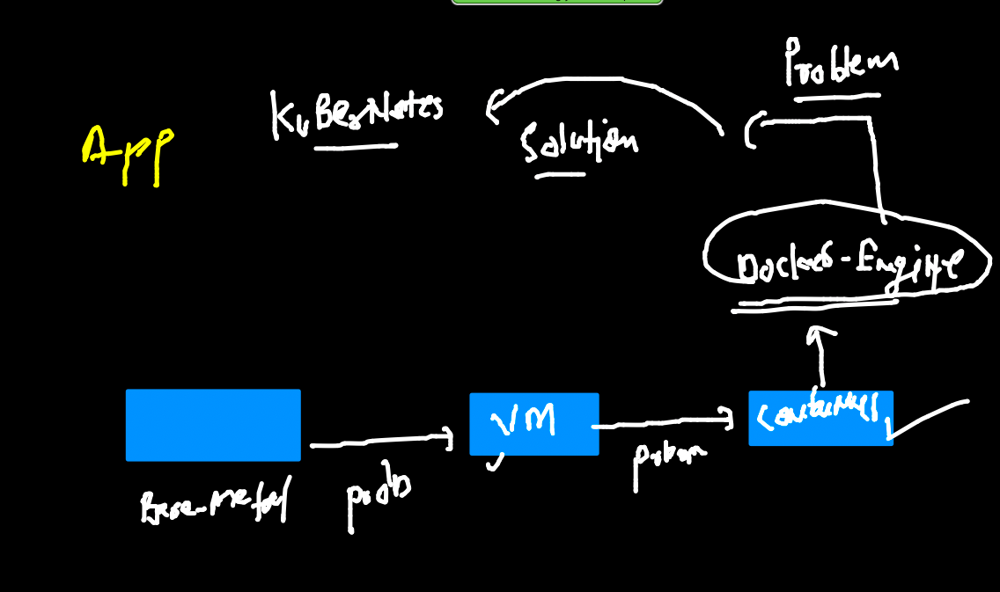
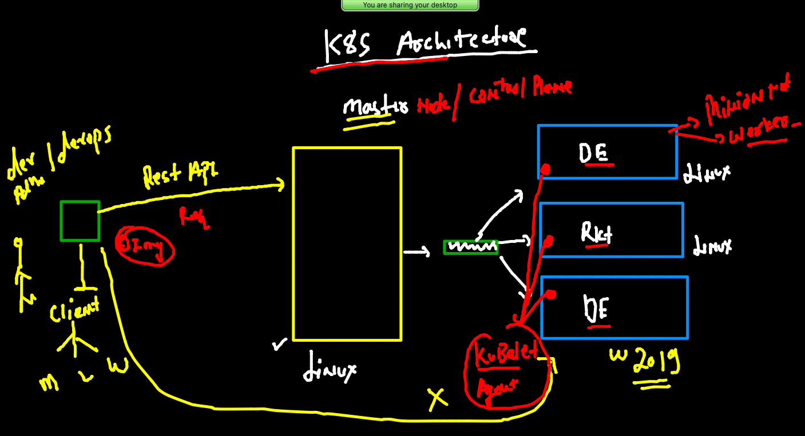
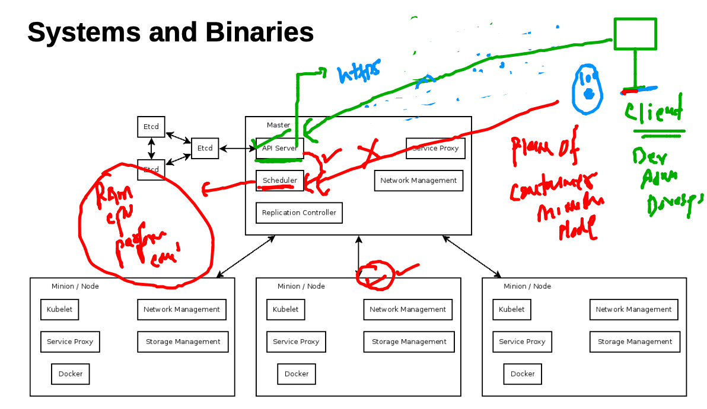
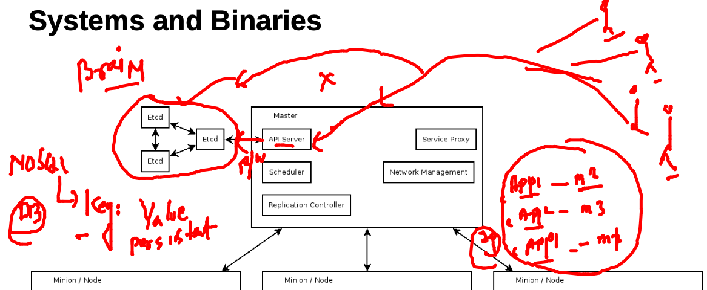
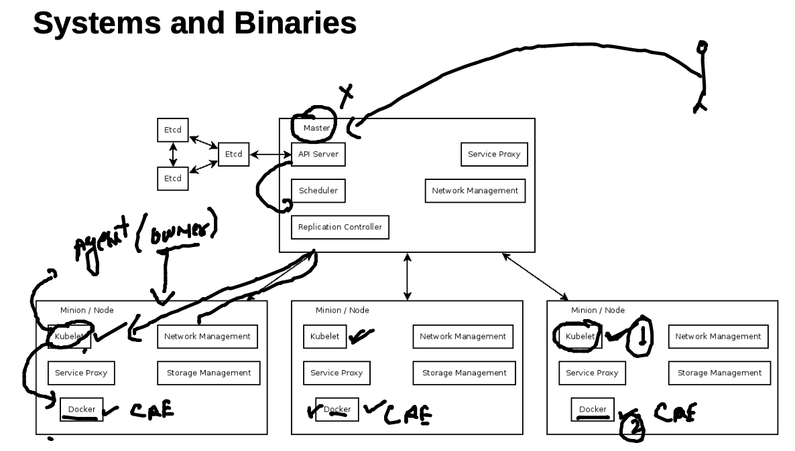
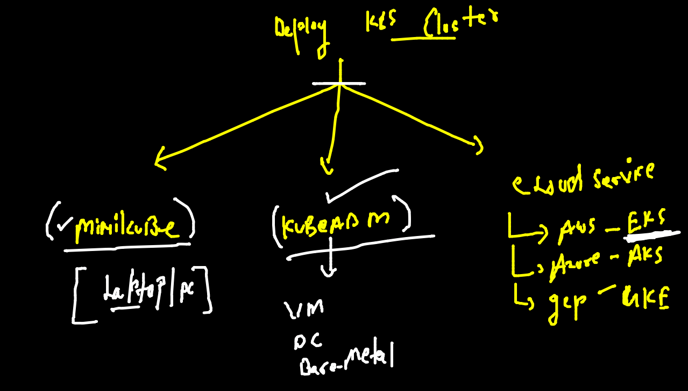
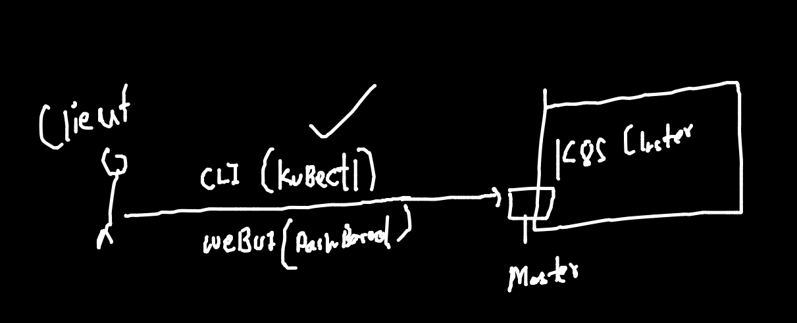
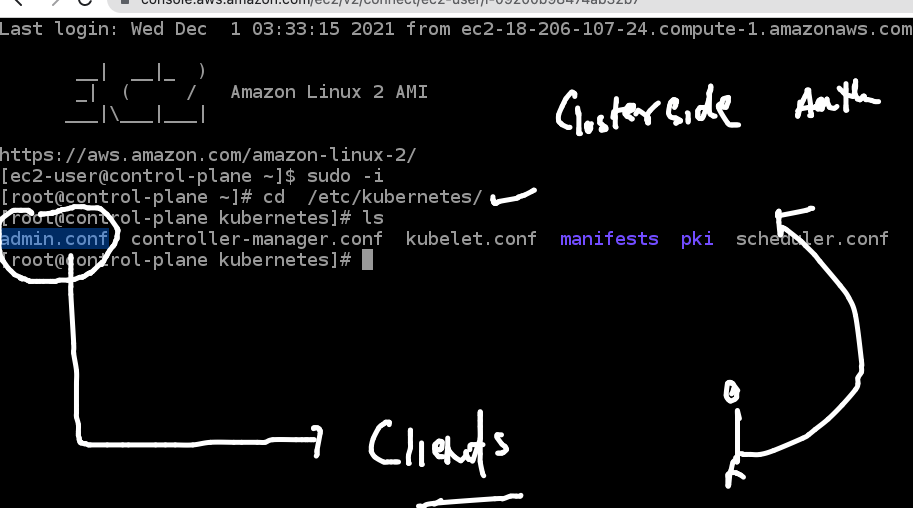
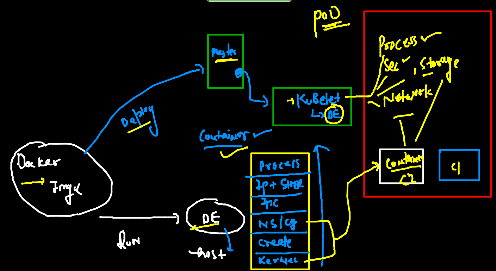

## training plan 


### journey 



### Container management / orchestration options

## Understanding k8s architecture 

### Infra understanding 



## Master Node /control plane component 

### kube-apiserver 


### kube-schedular 



### etcd 



## Minion nodes details 



### k8s setup methods 



### client side options to connect k8s master 



### k8s master auth file location 



### checking by kubectl 

```
 
 fire@ashutoshhs-MacBook-Air  ~/Desktop  kubectl  cluster-info  --kubeconfig=admin.conf.txt  
Kubernetes control plane is running at https://35.169.179.204:6443
CoreDNS is running at https://35.169.179.204:6443/api/v1/namespaces/kube-system/services/kube-dns:dns/proxy

To further debug and diagnose cluster problems, use 'kubectl cluster-info dump'.
 fire@ashutoshhs-MacBook-Air  ~/Desktop  
 fire@ashutoshhs-MacBook-Air  ~/Desktop  
 fire@ashutoshhs-MacBook-Air  ~/Desktop  kubectl  get  nodes   --kubeconfig=admin.conf.txt  
NAME            STATUS   ROLES                  AGE   VERSION
control-plane   Ready    control-plane,master   13h   v1.22.4
node1           Ready    <none>                 13h   v1.22.4
node2           Ready    <none>                 13h   v1.22.4
 fire@ashutoshhs-MacBook-Air  ~/Desktop  


```

### pasting admin.conf in client side under home directory 

```
cp  -v  ~/Desktop/admin.conf.txt  ~/.kube/config 
/Users/fire/Desktop/admin.conf.txt -> /Users/fire/.kube/config
 fire@ashutoshhs-MacBook-Air  ~/.kube  
 fire@ashutoshhs-MacBook-Air  ~/.kube  
 fire@ashutoshhs-MacBook-Air  ~/.kube  kubectl  get  nodes
NAME            STATUS   ROLES                  AGE   VERSION
control-plane   Ready    control-plane,master   13h   v1.22.4
node1           Ready    <none>                 13h   v1.22.4
node2           Ready    <none>                 13h   v1.22.4

```


### Intro to POD in k8s world 



### First POd file 

```
apiVersion: v1
kind: Pod
metadata:
 name: ashupod-1  # name of POD 
spec:
 containers: # one or more containers details 
 - name: ashuc1  # name of container 
   image: alpine # image from docker hub 
   command: ["sh","-c","ping fb.com"] # default process 
   
```

### creating pod using kubectl 

```
kubectl apply -f ashu-pod1.yaml
pod/ashupod-2 created
 fire@ashutoshhs-MacBook-Air  ~/Desktop/deployapps  kubectl  get  pods
NAME            READY   STATUS              RESTARTS      AGE
ashupod-2       1/1     Running             0             15s
chandra-pod-1   0/1     Error               2 (25s ago)   27s
pranipod-1      1/1     Running             0             41s
priyankapod-1   1/1     Running             0             62s
sathya-pod1     0/1     ContainerCreating   0             2s

```

### check minion node of my pod 

```
 kubectl  get  pods  ashupod-2 -o wide
NAME        READY   STATUS    RESTARTS   AGE     IP               NODE    NOMINATED NODE   READINESS GATES
ashupod-2   1/1     Running   0          5m24s   192.168.104.12   node2   <none>           <none>

```

### 

```
 kubectl  get  pods   -o wide         
NAME            READY   STATUS    RESTARTS   AGE     IP                NODE    NOMINATED NODE   READINESS GATES
amith-pod1      1/1     Running   0          5m25s   192.168.104.13    node2   <none>           <none>
ashupod-2       1/1     Running   0          6m14s   192.168.104.12    node2   <none>           <none>
ashwathpod-1    1/1     Running   0          4m48s   192.168.166.142   node1   <none>           <none>
chandra-pod-1   1/1     Running   0          3m59s   192.168.166.143   node1   <none>           <none>
go-pod-1        1/1     Running   0          3m15s   192.168.104.15    node2   <none>           <none>
manupod-1       1/1     Running   0          4m54s   192.168.166.141   n

```

### checking output of pods container 

```
7344  kubectl  logs  ashupod-2   
 7345  kubectl  logs  -f ashupod-2   
 
```

### pod container 

```
 kubectl  describe  pod  ashupod-2
Name:         ashupod-2
Namespace:    default
Priority:     0
Node:         node2/172.31.66.124
Start Time:   Wed, 01 Dec 2021 15:16:46 +0530
Labels:       <none>
Annotations:  cni.projectcalico.org/containerID: eb601c0300907fc5b8e5d15e13540e29d240d5c7733b158430ba5309d64c4fd6
              cni.projectcalico.org/podIP: 192.168.104.12/32
              cni.projectcalico.org/podIPs: 192.168.104.12/32
Status:       Running
IP:           192.168.104.12
IPs:
  IP:  192.168.104.12
Containers:
  ashuc1:
    Container ID:  docker://09ade575f6cb3d02e202d766d8d49098222da6f551d98769064b0d06df5ef198
    Image:         alpine
    Image ID:      docker-pullable://alpine@sha256:21a3deaa0d32a8057914f36584b5288d2e5ecc984380bc0118285c70fa8c9300
    Port:          <none>
    Host Port:     <none>
    Command:
      sh
      -c
      ping fb.com
    State:          Running
    
```

### access container running inside pod 

```

 fire@ashutoshhs-MacBook-Air  ~/Desktop/deployapps  kubectl  exec  -it  ashupod-2  -- sh 
/ # 
/ # 
/ # 
/ # cat  /etc/os-release 
NAME="Alpine Linux"
ID=alpine
VERSION_ID=3.15.0
PRETTY_NAME="Alpine Linux v3.15"
HOME_URL="https://alpinelinux.org/"
BUG_REPORT_URL="https://bugs.alpinelinux.org/"
/ # 
/ # ps  -e
PID   USER     TIME  COMMAND
    1 root      0:00 ping fb.com
    8 root      0:00 sh
   16 root      0:00 ps -e
/ # 
/ # exit

```

### deleting pod 

```
 kubectl delete po  ashupod-2
pod "ashupod-2" deleted
```

### manual scheduling 

```
apiVersion: v1
kind: Pod
metadata:
 name: ashupod-2  # name of POD 
spec:
 nodeName: node2 # manual scheduling 
 containers: # one or more containers details 
 - name: ashuc1  # name of container 
   image: alpine # image from docker hub 
   command: ["sh","-c","ping fb.com"] # default process 
   
```

### if modify yaml then 

```
kubectl replace -f ashu-pod1.yaml --force 
pod/ashupod-2 replaced
 fire@ashutoshhs-MacBook-Air  ~/Desktop/deployapps  kubectl get po -o wide                    
NAME            READY   STATUS    RESTARTS   AGE     IP                NODE    NOMINATED NODE   READINESS GATES
amith-pod1      1/1     Running   0          4m5s    192.168.104.19    node2   <none>           <none>
ashupod-2       1/1     Running   0          4s      192.168.166.146   node1   <none>           <none>

```


