## training plan 


### revision 

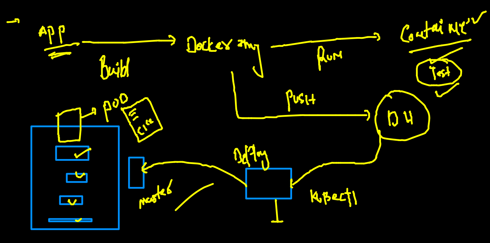
### setup k8s cluster in local pc / laptop 

[INstall_link](https://minikube.sigs.k8s.io/docs/start/)

###  minikube 

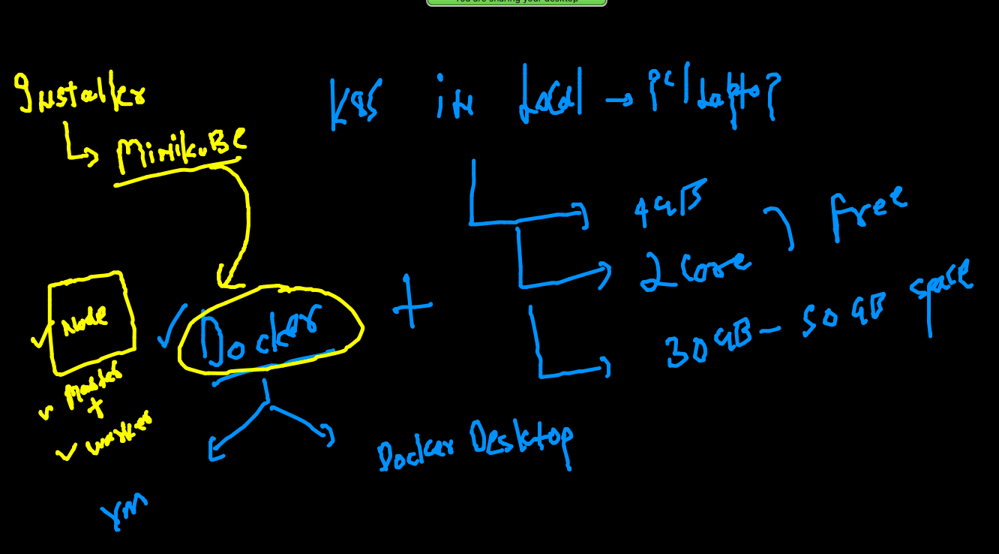

### checking 

```
minikube version 
minikube version: v1.24.0
commit: 76b94fb3c4e8ac5062daf70d60cf03ddcc0a741b

```

### kubectl for multiple cluster 

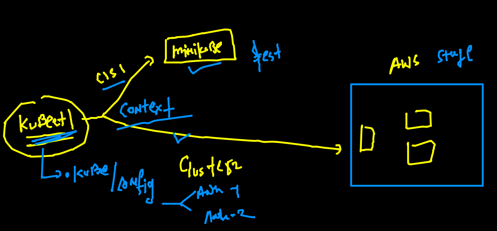

### start minikube cluster 

```
minikube  start  
😄  minikube v1.24.0 on Darwin 11.6
✨  Automatically selected the docker driver. Other choices: hyperkit, ssh
👍  Starting control plane node minikube in cluster minikube
🚜  Pulling base image ...
🔥  Creating docker container (CPUs=2, Memory=1986MB) ...
🐳  Preparing Kubernetes v1.22.3 on Docker 20.10.8 ...
    ▪ Generating certificates and keys ...
    ▪ Booting up control plane ...
    ▪ Configuring RBAC rules ...
🔎  Verifying Kubernetes components...
    ▪ Using image gcr.io/k8s-minikube/storage-provisioner:v5
🌟  Enabled addons: storage-provisioner, default-storageclass
🏄  Done! kubectl is now configured to use "minikube" cluster and "default" namespace by default

```

### auto connected by kubectl 

```
kubectl  get  nodes
NAME       STATUS   ROLES                  AGE   VERSION
minikube   Ready    control-plane,master   71s   v1.22.3
```
### more minikube commands 

```
minikube status 
minikube
type: Control Plane
host: Running
kubelet: Running
apiserver: Running
kubeconfig: Configured

 fire@ashutoshhs-MacBook-Air  ~  minikube stop   
✋  Stopping node "minikube"  ...
🛑  Powering off "minikube" via SSH ...
🛑  1 node stopped.
 fire@ashutoshhs-MacBook-Air  ~  minikube status 
minikube
type: Control Plane
host: Stopped
kubelet: Stopped
apiserver: Stopped
kubeconfig: Stopped


```


### switching between / among the cluster 

```
 kubectl  config  get-contexts 
CURRENT   NAME                          CLUSTER      AUTHINFO           NAMESPACE
          kubernetes-admin@kubernetes   kubernetes   kubernetes-admin   
*         minikube                      minikube     minikube           default
 fire@ashutoshhs-MacBook-Air  ~/Desktop/deployapps  
 fire@ashutoshhs-MacBook-Air  ~/Desktop/deployapps  
 fire@ashutoshhs-MacBook-Air  ~/Desktop/deployapps  kubectl  config  use-context  kubernetes-admin@kubernetes
Switched to context "kubernetes-admin@kubernetes".
 fire@ashutoshhs-MacBook-Air  ~/Desktop/deployapps  
 fire@ashutoshhs-MacBook-Air  ~/Desktop/deployapps  kubectl  config  get-contexts                            
CURRENT   NAME                          CLUSTER      AUTHINFO           NAMESPACE
*         kubernetes-admin@kubernetes   kubernetes   kubernetes-admin   
          minikube                      minikube     minikube           default
 fire@ashutoshhs-MacBook-Air  ~/Desktop/deployapps  kubectl  get  nodes
NAME            STATUS   ROLES                  AGE   VERSION
control-plane   Ready    control-plane,master   33h   v1.22.4
node1           Ready    <none>                 33h   v1.22.4
node2           Ready    <none>                 33h   v1.22.4

```

### Namespace in k8s 

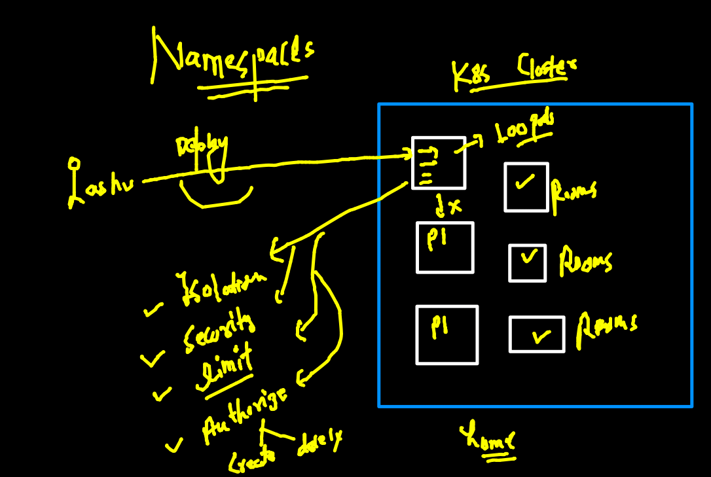

### list of default namespaces 

```
kubectl  get  ns
NAME              STATUS   AGE
default           Active   18m
kube-node-lease   Active   18m
kube-public       Active   18m
kube-system       Active   18m

```

### k8s internal component is running as pod 

```
 kubectl  get  po   -n kube-system  
NAME                                       READY   STATUS    RESTARTS      AGE
calico-kube-controllers-56b8f699d9-tddq6   1/1     Running   4 (17h ago)   33h
calico-node-fkc5d                          1/1     Running   3 (17h ago)   33h
calico-node-m2rht                          1/1     Running   3 (17h ago)   33h
calico-node-qjnk6                          1/1     Running   3 (17h ago)   33h
coredns-78fcd69978-ftrhb                   1/1     Running   3 (17h ago)   33h
coredns-78fcd69978-nnmtq                   1/1     Running   3 (17h ago)   33h
etcd-control-plane                         1/1     Running   3 (17h ago)   33h
kube-apiserver-control-plane               1/1     Running   3 (17h ago)   33h
kube-controller-manager-control-plane      1/1     Running   3 (17h ago)   33h
kube-proxy-bnzgf                           1/1     Running   3 (17h ago)   33h
kube-proxy-kl6mm                           1/1     Running   3 (17h ago)   33h
kube-proxy-rptk4                           1/1     Running   3 (17h ago)   33h

```

### setting namespace to default cluster 

```
 kubectl get  po
No resources found in default namespace.
 fire@ashutoshhs-MacBook-Air  ~/Desktop/deployapps  kubectl  config set-context  --current --namespace=ashu-space
Context "kubernetes-admin@kubernetes" modified.
 fire@ashutoshhs-MacBook-Air  ~/Desktop/deployapps  
 fire@ashutoshhs-MacBook-Air  ~/Desktop/deployapps  
 fire@ashutoshhs-MacBook-Air  ~/Desktop/deployapps  kubectl get  po                                              
No resources found in ashu-space namespace.
 fire@ashutoshhs-MacBook-Air  ~/Desktop/deployapps  
 fire@ashutoshhs-MacBook-Air  ~/Desktop/deployapps  
 fire@ashutoshhs-MacBook-Air  ~/Desktop/deployapps  kubectl  config get-contexts 
CURRENT   NAME                          CLUSTER      AUTHINFO           NAMESPACE
*         kubernetes-admin@kubernetes   kubernetes   kubernetes-admin   ashu-space
          minikube                      minikube     minikube           default
 fire@ashutoshhs-MacBook-Air  ~/Desktop/deployapps  
 
 ```
 
 ### building multi stage dockerfile 
 
 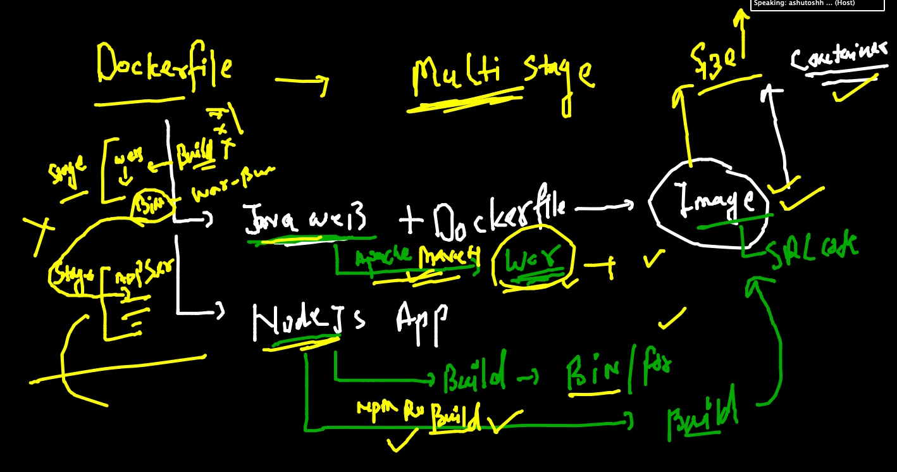
 
 
 ```
 FROM oraclelinux:8.3  as Builder
LABEL "name"="ashutoshh"
RUN dnf install java-1.8.0-openjdk.x86_64 java-1.8.0-openjdk-devel.x86_64  -y
RUN dnf install maven -y
RUN mkdir /javawebapp
WORKDIR /javawebapp
COPY . . 
# to build project into war file 
RUN mvn clean package


FROM tomcat 
MAINTAINER ashutoshh@linux.com
RUN mkdir  /myapp
COPY  --from=Builder  /javawebapp  /myapp
RUN cp -rvf  /myapp/target/WebApp.war  /usr/local/tomcat/webapps/
RUN rm -rf /myapp
EXPOSE 8080
 ```

### 

```
docker build  -t  dockerashu/ciscojavaapp:v1  https://github.com/redashu/java-springboot.git
```

## Networking in k8s 

### Node networking  (handle by Infra / network team )

### Pod networking  (k8s engg)

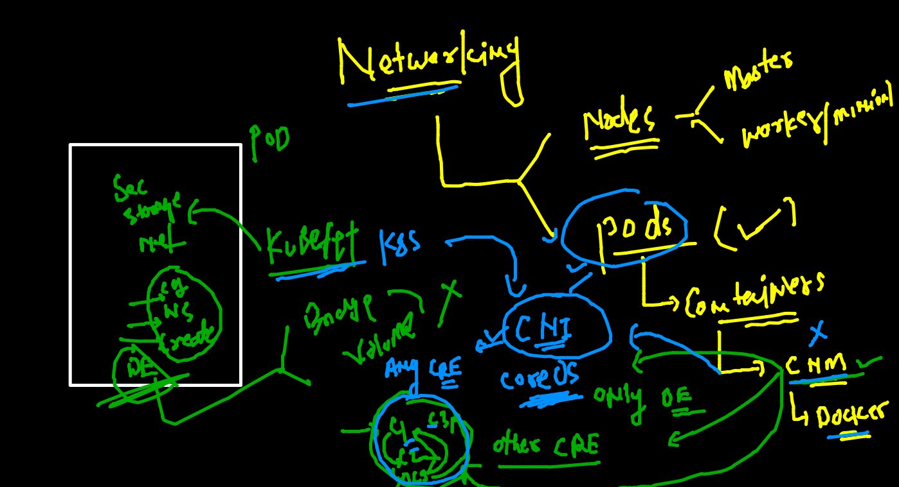

### list of CNI 

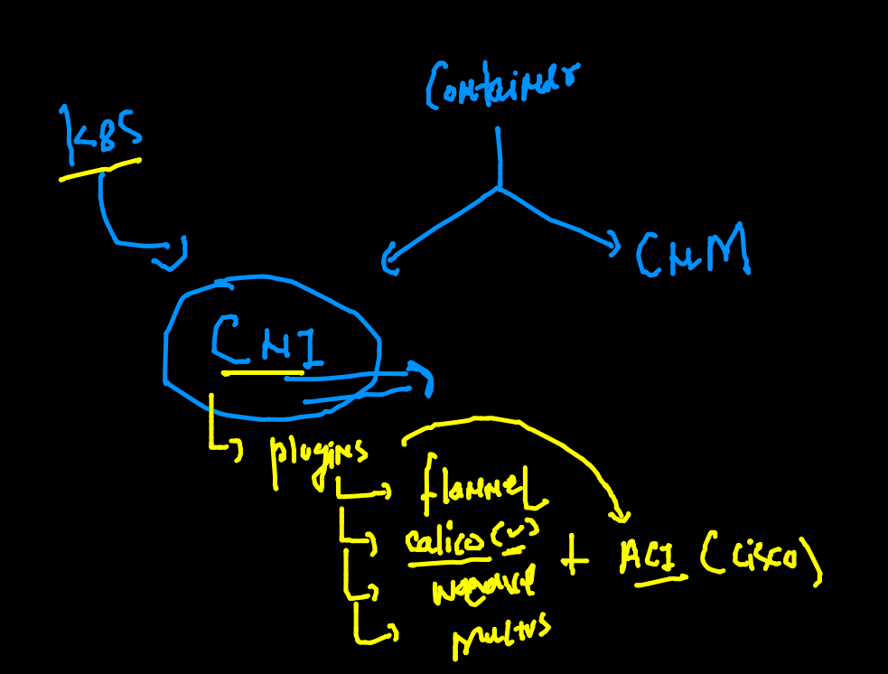

### pod can connect to each other by default independent of Namespaces 

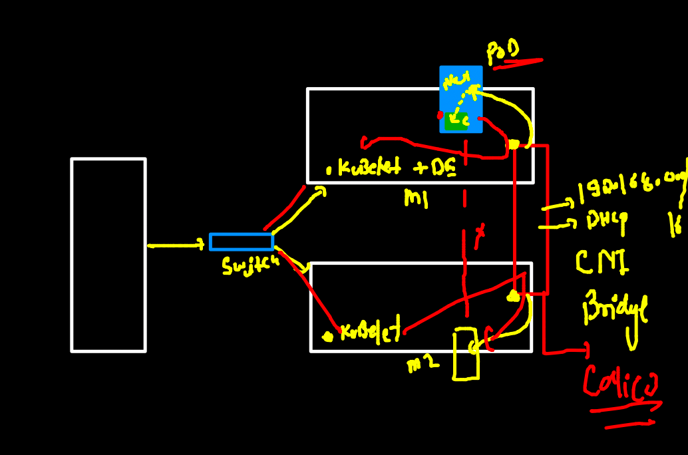

### access pod app running in k8s cluster 

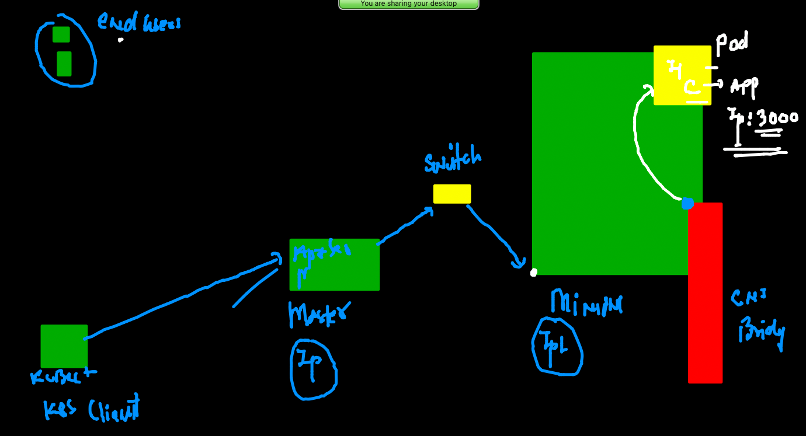

### Node app deployment and access 

### 

```
kubectl run ashunodeapp --image=dockerashu/nodejs:v1  --port 3000 --dry-run=client  -o yaml  >nodeapp.yaml 

```

### access app 

### case 1 :  from kubectl client machine 

```
kubectl  port-forward  ashunodeapp  1122:3000
Forwarding from 127.0.0.1:1122 -> 3000
Forwarding from [::1]:1122 -> 3000
Handling connection for 1122
Handling connection for 1122

```

### case1 when kubectl system is access app running in POd 

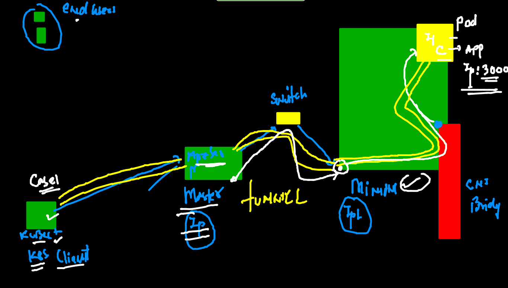

### AS END user point of view 
### Discussion 1

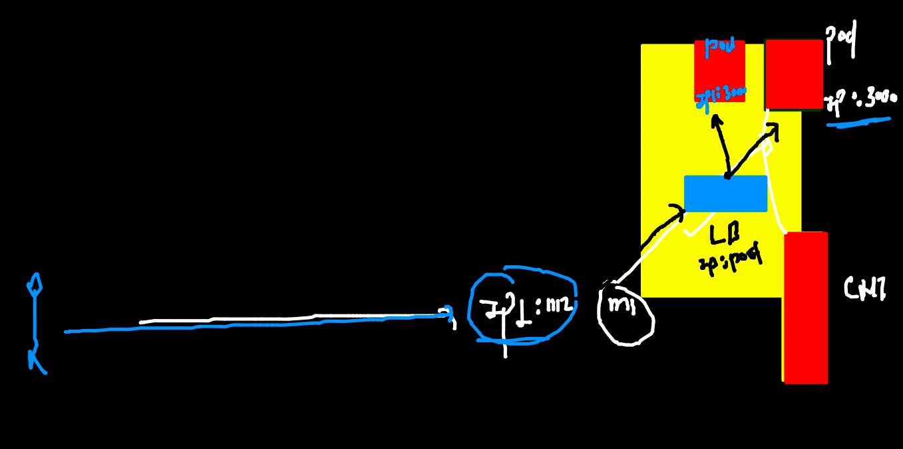

### Discussion 2 

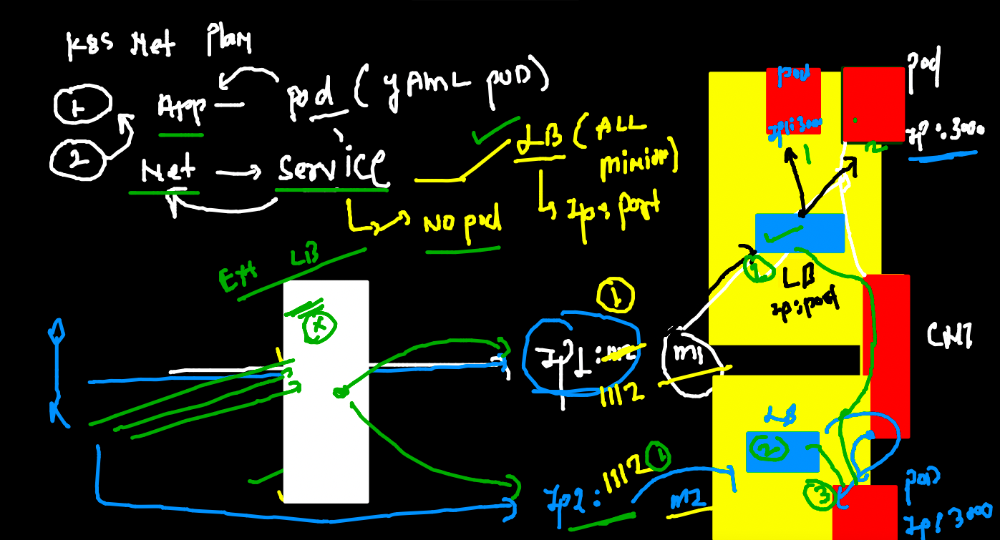

### SErvice will use label / tag of apps -- to find all the pods and forward traffic to there 

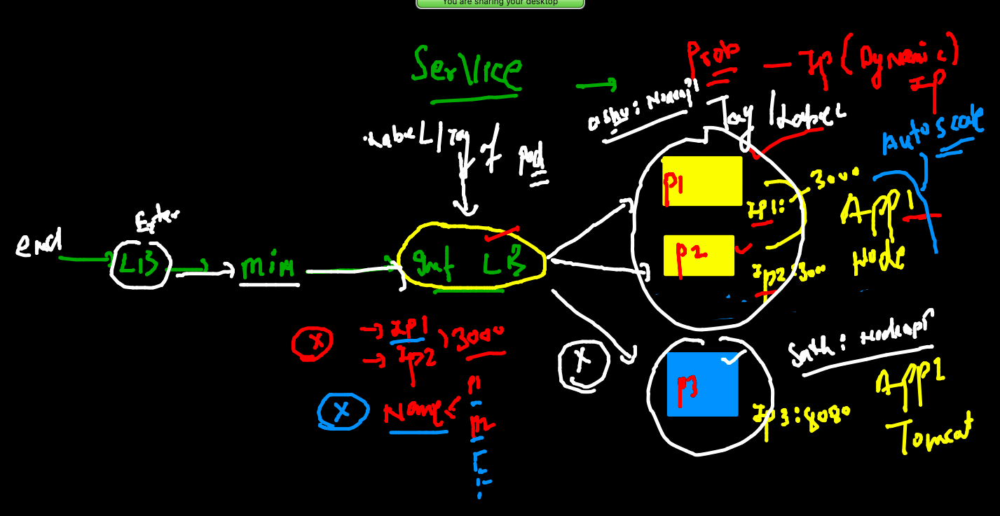

### assign label to pod 

```
kubectl apply -f nodeapp.yaml 
pod/ashunodeapp configured
 fire@ashutoshhs-MacBook-Air  ~/Desktop/deployapps  kubectl  get po 
NAME          READY   STATUS    RESTARTS   AGE
ashunodeapp   1/1     Running   0          38m
 fire@ashutoshhs-MacBook-Air  ~/Desktop/deployapps  kubectl  get po --show-labels 
NAME          READY   STATUS    RESTARTS   AGE   LABELS
ashunodeapp   1/1     Running   0          38m   ashu=nodeapp1

```

### service type 

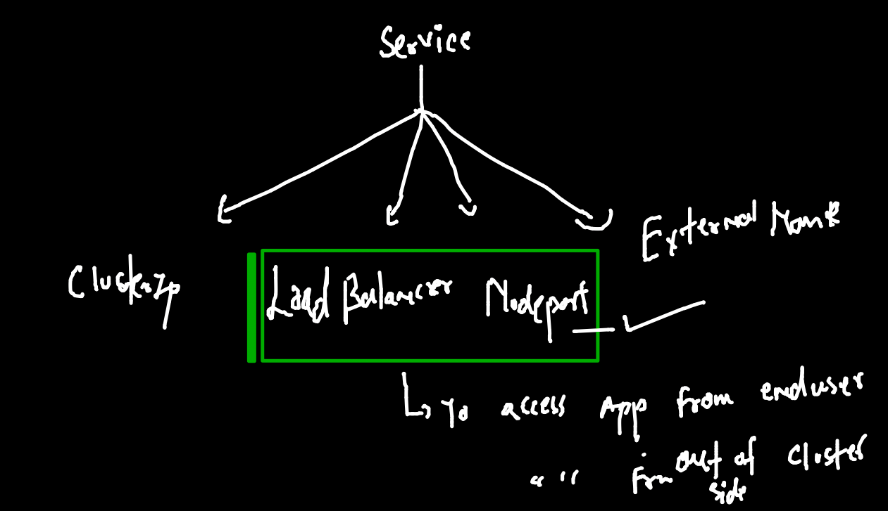

### NodePort type service 

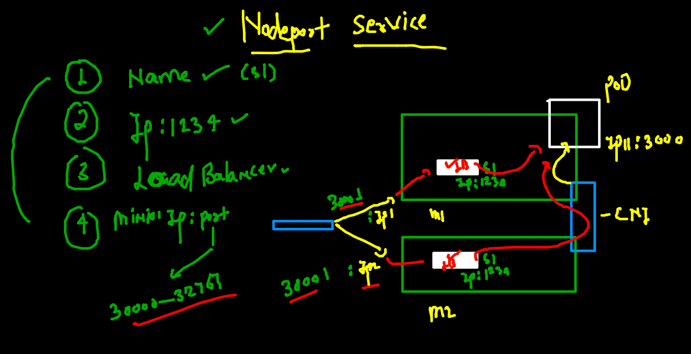

### creating nodeport svc 

```
kubectl  create  service  
Create a service using a specified subcommand.

Aliases:
service, svc

Available Commands:
  clusterip    Create a ClusterIP service
  externalname Create an ExternalName service
  loadbalancer Create a LoadBalancer service
  nodeport     Create a NodePort service
  
  ===
  
 kubectl  create  service  nodeport ashusvc1     --tcp  1234:3000  --dry-run=client  -o yaml
apiVersion: v1
kind: Service
metadata:
  creationTimestamp: null
  labels:
    app: ashusvc1
  name: ashusvc1
spec:
  ports:
  - name: 1234-3000
    port: 1234
    protocol: TCP
    targetPort: 3000
  selector:
    app: ashusvc1
  type: NodePort
status:
  loadBalancer: {}
 fire@ashutoshhs-MacBook-Air  ~/Desktop/deployapps  kubectl  create  service  nodeport ashusvc1     --tcp  1234:3000  --dry-run=client  -o yaml  >nodesvc.yaml
 
 ```
 
 ### list 
 
 ```
 fire@ashutoshhs-MacBook-Air  ~/Desktop/deployapps  
 fire@ashutoshhs-MacBook-Air  ~/Desktop/deployapps  kubectl  get po --show-labels NAME          READY   STATUS    RESTARTS   AGE   LABELS
ashunodeapp   1/1     Running   0          53m   ashu=nodeapp1
 fire@ashutoshhs-MacBook-Air  ~/Desktop/deployapps  kubectl apply -f nodesvc.yaml 
service/ashusvc1 created
 fire@ashutoshhs-MacBook-Air  ~/Desktop/deployapps  kubectl  get  svc 
NAME       TYPE       CLUSTER-IP      EXTERNAL-IP   PORT(S)          AGE
ashusvc1   NodePort   10.99.222.170   <none>        1234:30929/TCP   13s
 fire@ashutoshhs-MacBook-Air  ~/Desktop/deployapps  kubectl  get  svc  -o wide
NAME       TYPE       CLUSTER-IP      EXTERNAL-IP   PORT(S)          AGE   SELECTOR
ashusvc1   NodePort   10.99.222.170   <none>        1234:30929/TCP   58s   ashu=nodeapp1
 fire@ashutoshhs-MacBook-Air  ~/Desktop/deployapps  

```
## serivce view 

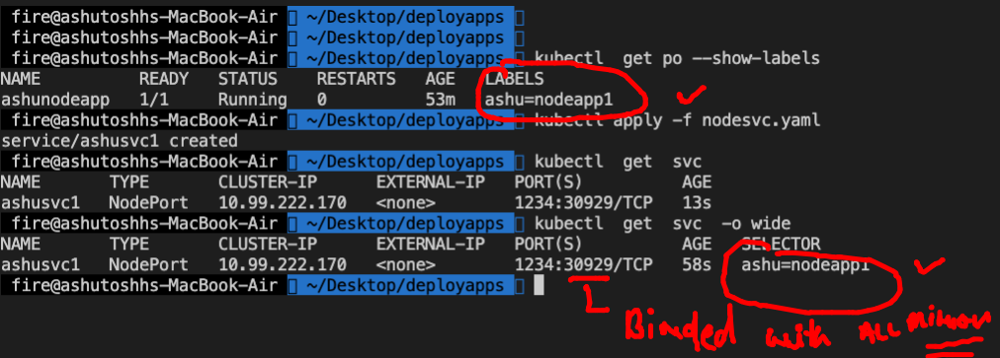

### more k8s commands 

```
 kubectl get  pod,svc
NAME              READY   STATUS    RESTARTS   AGE
pod/ashunodeapp   1/1     Running   0          143m

NAME               TYPE       CLUSTER-IP      EXTERNAL-IP   PORT(S)          AGE
service/ashusvc1   NodePort   10.99.222.170   <none>        1234:30929/TCP   87m
 fire@ashutoshhs-MacBook-Air  ~/Desktop/deployapps  kubectl get all     
NAME              READY   STATUS    RESTARTS   AGE
pod/ashunodeapp   1/1     Running   0          143m

NAME               TYPE       CLUSTER-IP      EXTERNAL-IP   PORT(S)          AGE
service/ashusvc1   NodePort   10.99.222.170   <none>        1234:30929/TCP   87m

```

### merge file 

```
apiVersion: v1
kind: Pod
metadata:
  creationTimestamp: null
  labels: # to assign lable / tag to this pod so that service can find it
    ashu: nodeapp1 # key and value --etcd (nosql key: value)
  name: ashunodeapp # name of pod 
  namespace: ashu-space # namespace info 
spec:
  containers:
  - image: dockerashu/nodejs:v1 # docker image 
    name: ashunodeapp # name of container 
    ports: # app port 
    - containerPort: 3000
    resources: {}
  dnsPolicy: ClusterFirst
  restartPolicy: Always
status: {}

---
apiVersion: v1
kind: Service
metadata:
  creationTimestamp: null
  labels:
    app: ashusvc1
  name: ashusvc1 # name of service 
  namespace: ashu-space # namespace info 
spec:
  ports:
  - name: 1234-3000
    port: 1234 # port of service 
    protocol: TCP
    targetPort: 3000 # port of app 
  selector: # Pod finder using given label 
    ashu: nodeapp1 # label of pod 
  type: NodePort # type of service 
status:
  loadBalancer: {}

```
### moving app deployment from POd --to-- Deployment in k8s 

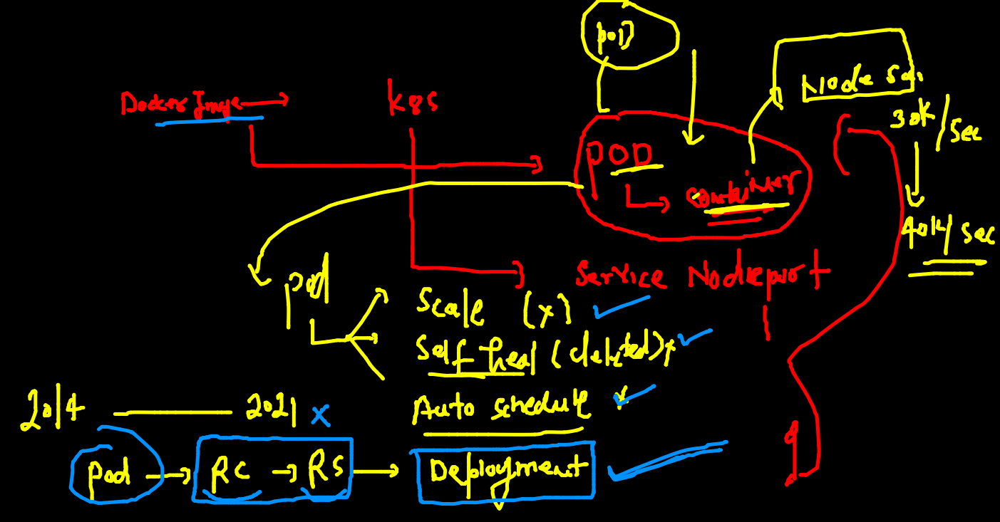

### Deployment 

```
kubectl  create deployment  ashuapp --image=dockerashu/nodejs:v1   --dry-run=client -o yaml   >ashudeploy.yaml

```

### YAML OF deployment 

```
apiVersion: apps/v1
kind: Deployment
metadata:
  creationTimestamp: null
  labels:
    app: ashuapp
  name: ashuapp # name of deployment 
spec:
  replicas: 1 # number of pod 
  selector:
    matchLabels:
      app: ashuapp
  strategy: {}
  template: # will use template to create POD 
    metadata:
      creationTimestamp: null
      labels: # label of pod 
        app: ashuapp
    spec:
      containers:
      - image: dockerashu/nodejs:v1 # image name 
        name: nodejs # name of container 
        resources: {}
status: {}


```

### deploy yaml 

```

kubectl apply -f ashudeploy.yaml 
deployment.apps/ashuapp created
 fire@ashutoshhs-MacBook-Air  ~/Desktop/deployapps  
 fire@ashutoshhs-MacBook-Air  ~/Desktop/deployapps  kubectl get deployment 
NAME      READY   UP-TO-DATE   AVAILABLE   AGE
ashuapp   1/1     1            1           8s
 fire@ashutoshhs-MacBook-Air  ~/Desktop/deployapps  kubectl get deploy     
NAME      READY   UP-TO-DATE   AVAILABLE   AGE
ashuapp   1/1     1            1           13s
 fire@ashutoshhs-MacBook-Air  ~/Desktop/deployapps  kubectl get  pod  
NAME                       READY   STATUS    RESTARTS   AGE
ashuapp-867479f7df-5rlv5   1/1     Running   0          25s
 fire@ashutoshhs-MacBook-Air  ~/Desktop/deployapps  kubectl  delete pod ashuapp-867479f7df-5rlv5
pod "ashuapp-867479f7df-5rlv5" deleted
 fire@ashutoshhs-MacBook-Air  ~/Desktop/deployapps  kubectl get  pod                            
NAME                       READY   STATUS             RESTARTS     AGE
ashuapp-867479f7df-8j7t4   1/1     Running            0            13s

```

### creating service so that it can match label 

```
kubectl  expose deployment  ashuapp --type        NodePort   --port 3000 --name ashusvc2  
service/ashusvc2 exposed
 fire@ashutoshhs-MacBook-Air  ~/Desktop/deployapps  kubectl  get  svc
NAME        TYPE       CLUSTER-IP       EXTERNAL-IP   PORT(S)          AGE
ashusvc2    NodePort   10.96.20.219     <none>        3000:30692/TCP   7s

```

### manual pod scaling using deployment 

```
kubectl  scale deployment  ashuapp  --replicas=3
deployment.apps/ashuapp scaled
 fire@ashutoshhs-MacBook-Air  ~/Desktop/deployapps  
 fire@ashutoshhs-MacBook-Air  ~/Desktop/deployapps  
 fire@ashutoshhs-MacBook-Air  ~/Desktop/deployapps  kubectl get deployNAME      READY   UP-TO-DATE   AVAILABLE   AGE
ashuapp   3/3     3            3           9m23s
 fire@ashutoshhs-MacBook-Air  ~/Desktop/deployapps  kubectl get po    
NAME                       READY   STATUS    RESTARTS   AGE
ashuapp-867479f7df-8j7t4   1/1     Running   0          8m39s
ashuapp-867479f7df-b8jh2   1/1     Running   0          12s
ashuapp-867479f7df-chf8n   1/1     Running   0          12s

```


