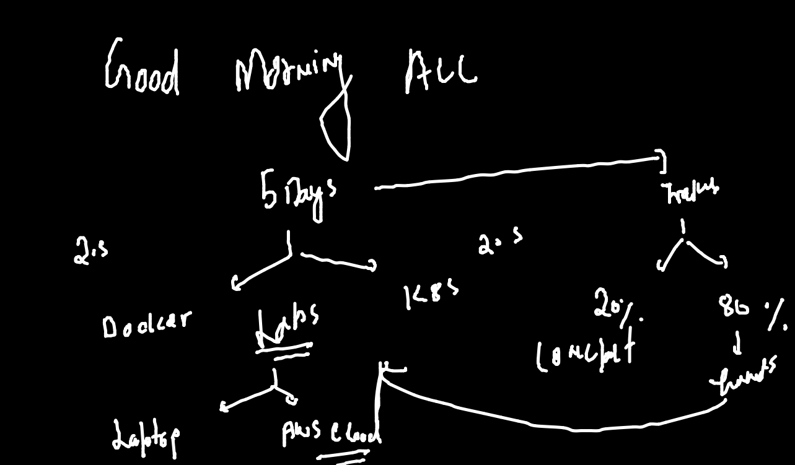
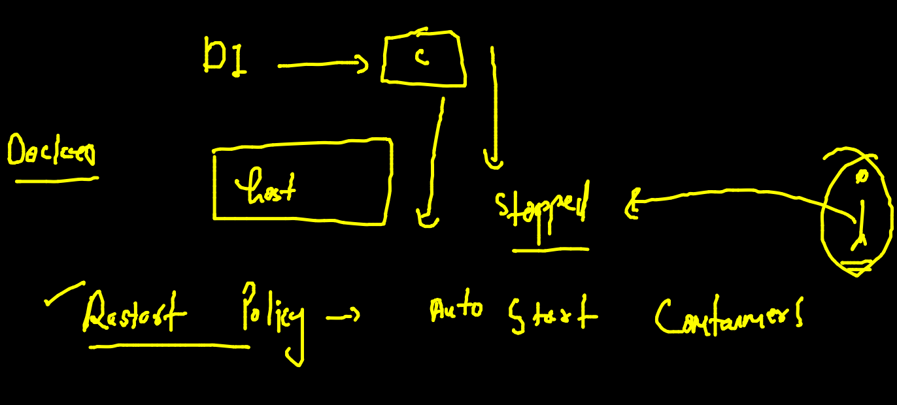
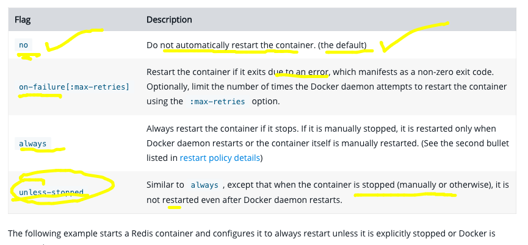

## training plan 



### DMA -- Dynamic memory allocation -- Cgroups 


### implementing cgroups in container 

```
22  docker run -d --name ashupyc2     --memory 200m      847b4522ef83
  123  docker run -d --name ashupyc3  --cpu-shares=20     --memory 200m      847b4522ef83
```

### restart policy in docker for auto starting container 



### list of restart policy 



### checking restart policy of your container 

```
docker  inspect  ashupyc3  --format='{{.HostConfig.RestartPolicy.Name}}'
```

### assign restart policy to container 

```
docker run -itd --name mec1  --restart always  alpine ping fb.com 
eabd96b9997cfc10811d768a64f0bccb9f860d5d66c7dba4a4d8e70d3ce5ee27
[ec2-user@ip-172-31-90-223 appimages]$ 
[ec2-user@ip-172-31-90-223 appimages]$ 
[ec2-user@ip-172-31-90-223 appimages]$ 
[ec2-user@ip-172-31-90-223 appimages]$ docker  inspect  mec1  --format='{{.HostConfig.RestartPolicy.Name}}'
always

```


