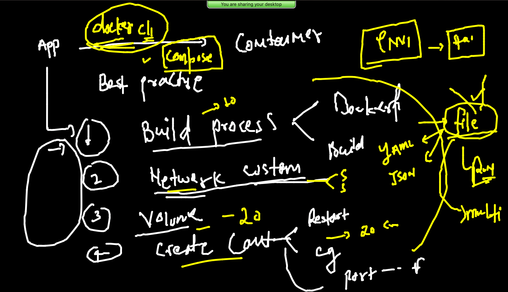
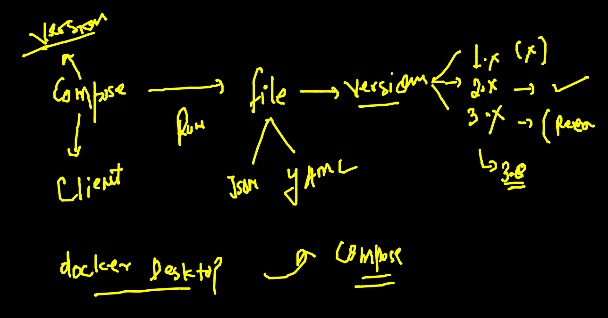
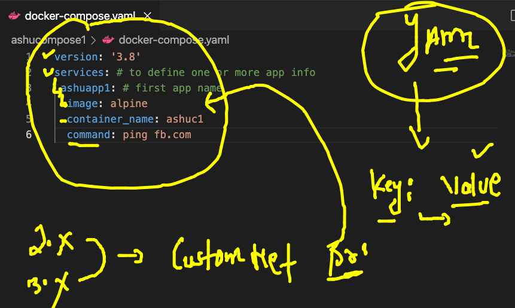

## training plan 


### Summary of docker 


### Container registry options 


### Container storage need 


### Docker volume 


### generating docker image for data generation 

```
s]$ ls
javaapp  project-website-template  pythonapp  script
[ec2-user@ip-172-31-90-223 appimages]$ cd  script/
[ec2-user@ip-172-31-90-223 script]$ ls
data.sh  Dockerfile
[ec2-user@ip-172-31-90-223 script]$ docker  build -t  dockerashu/script:genv1 . 
Sending build context to Docker daemon  3.072kB
Step 1/7 : FROM ubuntu
 ---> ba6acccedd29
Step 2/7 : LABEL email=ashutoshh@linux.com
 ---> Running in ade2e010a7db
Removing intermediate container ade2e010a7db
 ---> 0b78c2e8d63a
 
 ```
### testing container 

```
 docker run -itd --name ashuc1  dockerashu/script:genv1 
acff78ff95e2287f3d0f1ff80a8bc052def80b2dc03dd4681d9d670b3f457f27
[ec2-user@ip-172-31-90-223 script]$ docker  ps
CONTAINER ID   IMAGE                     COMMAND       CREATED         STATUS         PORTS     NAMES
acff78ff95e2   dockerashu/script:genv1   "./data.sh"   3 seconds ago   Up 2 seconds             ashuc1
a7d953949185   chandra-script            "./data.sh"   3 seconds ago   Up 2 seconds             chandra-c1
[ec2-user@ip-172-31-90-223 script]$ docker exec -it  ashuc1  bash 
root@acff78ff95e2:/code# cd  /tmp/
root@acff78ff95e2:/tmp# ls
cisco.txt
root@acff78ff95e2:/tmp# cat  cisco.txt 
Hello Cisco this is my data ..
Hello Cisco this is my data ..
Hello Cisco this is my data ..
Hello Cisco this is my data ..
Hello Cisco this is my data ..
root@acff78ff95e2:/tmp# cat  cisco.txt 
Hello Cisco this is my data ..
Hello Cisco this is my data ..
Hello Cisco this is my data ..
Hello Cisco this is my data ..
Hello Cisco this is my data ..
Hello Cisco this is my data ..

```

### docker volume creation 

```
356  docker  volume    create   ashuvol1 
  357  docker  volume  ls
  358  docker  volume rm  e9a6812a347f1617658e289fb46deb5b3435c06f7941946a23dd7405df53c7f6 cff2eca4ddeeb73530fd67d60a0c063039ffc4530848a22cfac99ab4a6ab5036 a8c3cc7e5782dabe947fd7ca6fac58c603fd364f42f533bee3fc8fe497cbb384
  359  history 
[ec2-user@ip-172-31-90-223 script]$ docker  volume  lsDRIVER    VOLUME NAME
local     ashuvol1
local     go_vol1
local     priyankavol1
local     subhravol1
[ec2-user@ip-172-31-90-223 script]$ docker volume  inspect  ashuvol1
[
    {
        "CreatedAt": "2021-12-01T04:59:00Z",
        "Driver": "local",
        "Labels": {},
        "Mountpoint": "/var/lib/docker/volumes/ashuvol1/_data",
        "Name": "ashuvol1",
        "Options": {},
        "Scope": "local"
    }
]

```

### creating container with volume 

```
docker run -itd --name ashuc1   -v  ashuvol1:/tmp:rw      dockerashu/script:genv1
702517605ae83013ab0091a76586f1aceedd13a732ac2964198a4c1db9088248

```

#### checking data in docker engine from backend 

```
[ec2-user@ip-172-31-90-223 ~]$ sudo -i
[root@ip-172-31-90-223 ~]# cd  /var/lib/docker/
[root@ip-172-31-90-223 docker]# ls
buildkit  containers  image  network  overlay2  plugins  runtimes  swarm  tmp  trust  volumes
[root@ip-172-31-90-223 docker]# cd  volumes/
[root@ip-172-31-90-223 volumes]# ls
amith_vol  ashwathv1          chandra-volume  m1vol1       msn        priyankavol1  sayedvol1
ashuvol1   backingFsBlockDev  go_vol1         metadata.db  pranivol1  sathyav1      subhravol1
[root@ip-172-31-90-223 volumes]# cd  ashuvol1/
[root@ip-172-31-90-223 ashuvol1]# ls
_data
[root@ip-172-31-90-223 ashuvol1]# cd  _data/
[root@ip-172-31-90-223 _data]# ls
cisco.txt
[root@ip-172-31-90-223 _data]# cat  cisco.txt 
Hello Cisco this is my data ..
Hello Cisco this is my data ..
Hello Cisco this is my data ..
Hello Cisco this is my data ..
Hello Cisco this is my data ..
Hello Cisco this is my data .

```

### single volume can be part of diff containers

```
 docker  run -it --rm  -v   ashuvol1:/checkdata:ro  alpine  sh 
/ # 
/ # 
/ # cd  /checkdata/
/checkdata # ls
cisco.txt
/checkdata # rm cisco.txt 
rm: remove 'cisco.txt'? y
rm: can't remove 'cisco.txt': Read-only file system
/checkdata # cat  cisco.txt 
Hello Cisco this is my data ..
Hello Cisco this is my data ..

```

### any custom location from docker host as volume 

```
docker  run -d --name ashuweb -p 1188:80 -v /home/ec2-user/appimages/project-website-template:/usr/share/nginx/html:ro  nginx

```
### remove volumes 

```
ec2-user@ip-172-31-90-223 pythonapp]$ docker volume  ls
[ec2-user@ip-172-31-90-223 pythonapp]$ docker volume  prune 
WARNING! This will remove all local volumes not used by at least one container.
Are you sure you want to continue? [y/N] y
Deleted Volumes:
msn
sathyav1
m1vol1
chandra-volume
sayedvol1

```

### Docker compose 



### docker-compose file info 



### Install compose in non docker desktop client 

```
 sudo curl -L "https://github.com/docker/compose/releases/download/1.29.2/docker-compose-$(uname -
s)-$(uname -m)" -o /usr/local/bin/docker-compose
  % Total    % Received % Xferd  Average Speed   Time    Time     Time  Current
                                 Dload  Upload   Total   Spent    Left  Speed
100   633  100   633    0     0  37235      0 --:--:-- --:--:-- --:--:-- 37235
100 12.1M  100 12.1M    0     0  74.9M      0 --:--:-- --:--:-- --:--:-- 74.9M
[ec2-user@ip-172-31-90-223 ~]$ sudo chmod +x /usr/local/bin/docker-compose
[ec2-user@ip-172-31-90-223 ~]$ sudo ln -s /usr/local/bin/docker-compose /usr/bin/docker-compose
[ec2-user@ip-172-31-90-223 ~]$ 

```

### compose version 

```
docker-compose  -v
docker-compose version 1.29.2, build 5becea4c

```

###

```
docker-compose  version 
docker-compose version 1.29.2, build 5becea4c
docker-py version: 5.0.0
CPython version: 3.7.10
OpenSSL version: OpenSSL 1.1.0l  10 Sep 2019

```

###  compose example 1 



### running file 

```
 ls
docker-compose.yaml
[ec2-user@ip-172-31-90-223 ashucompose1]$ docker-compose  up -d 
Creating network "ashucompose1_default" with the default driver
Creating ashuc1 ... done
[ec2-user@ip-172-31-90-223 ashucompose1]$ docker-compose  ps
 Name      Command     State   Ports
------------------------------------
ashuc1   ping fb.com   Up           
[ec2-user@ip-172-31-90-223 ashucompose1]$ docker-compose  images
Container   Repository    Tag       Image Id       Size  
---------------------------------------------------------
ashuc1      alpine       latest   c059bfaa849c   5.586 MB

```

### more compose instruction 

```
485  docker-compose  up -d 
  486  docker-compose  ps
  487  docker-compose  images
  488  history 
  489  ls
  490  docker-compose  logs
  491  docker-compose  logs -f
  492  history 
  493  docker-compose ps
  494  docker-compose  stop
  495  docker-compose  start
  496  docker-compose  ps
  497  docker-compose  kill
  498  docker-compose  ps
  499  docker-compose  start
  500  docker-compose  kill
  501  docker-compose  rm 
  502  docker-compose  up -d
  
```

### cleaning up 

```
docker-compose  down 
Stopping ashuc1 ... done
Removing ashuc1 ... done
Removing network ashucompose1_default

```

### example 2 

```
version: '3.8'
services: # to define one or more app info 
 ashuapp1: # first app name 
  image: alpine
  container_name: ashuc1
  command: ping fb.com 
 ashunodeapp: # second app name 
  image: ashunodejs:v001  # image to be build
  build: # to build image with location and name of dockerfile
   context: ./Nodejs
   dockerfile: Dockerfile 
  container_name: ashunodec1 
  ports: # for port forwarding 
  - "3344:3000"
  restart: always # restart policy 

```


### running 

```
docker-compose  up -d
Creating network "ashucompose1_default" with the default driver
Building ashunodeapp
Sending build context to Docker daemon  11.97MB
Step 1/11 : FROM ubuntu
 ---> ba6acccedd29
Step 2/11 : RUN apt-get update && apt-get install git curl  gcc g++ make  -y
 ---> Using cache
 ---> e2df68157268
Step 3/11 : RUN mkdir /setupNode
 ---> Using cache
 ---> eb007427e9ea
Step 4/11 : WORKDIR /setupNode
 ---> Using cache
 
 ```
 
 ### handling particular container app 
 
 ```
 18  docker-compose  kill  ashuapp1
  519  docker-compose ps
  520  docker-compose  start  ashuapp1
  
```


