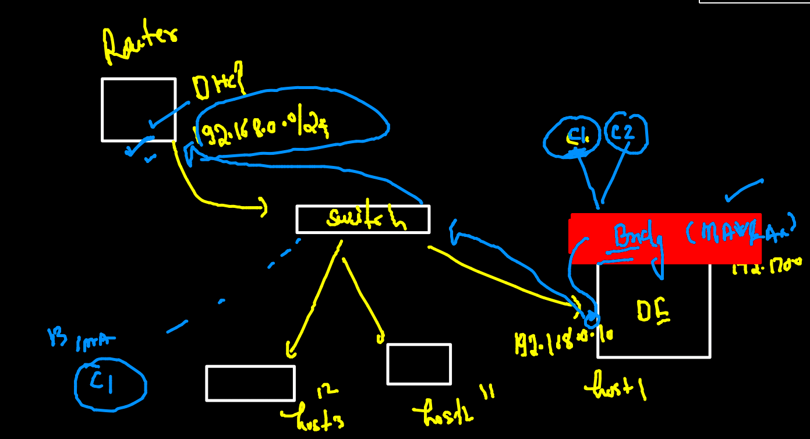

## training plan 


### DMA -- Dynamic memory allocation -- Cgroups 


### implementing cgroups in container 

```
22  docker run -d --name ashupyc2     --memory 200m      847b4522ef83
  123  docker run -d --name ashupyc3  --cpu-shares=20     --memory 200m      847b4522ef83
```

### restart policy in docker for auto starting container 


### list of restart policy 


### checking restart policy of your container 

```
docker  inspect  ashupyc3  --format='{{.HostConfig.RestartPolicy.Name}}'
```

### assign restart policy to container 

```
docker run -itd --name mec1  --restart always  alpine ping fb.com 
eabd96b9997cfc10811d768a64f0bccb9f860d5d66c7dba4a4d8e70d3ce5ee27
[ec2-user@ip-172-31-90-223 appimages]$ 
[ec2-user@ip-172-31-90-223 appimages]$ 
[ec2-user@ip-172-31-90-223 appimages]$ 
[ec2-user@ip-172-31-90-223 appimages]$ docker  inspect  mec1  --format='{{.HostConfig.RestartPolicy.Name}}'
always

```

### dockerfile for Java sample code 

### building image 
```
docker  build -t  ashujava:codev1 . 
Sending build context to Docker daemon  3.072kB
Step 1/7 : FROM openjdk
 ---> 1b3756d6df61
Step 2/7 : LABEL email=ashutoshh@linux.com
 ---> Running in 6167abc67ae1
Removing intermediate container 6167abc67ae1
 ---> 2dda1342f0f2
Step 3/7 : RUN mkdir /codedata
 ---> Running in fc6cd8ab4661
Removing intermediate container fc6cd8ab4661
 ---> cb6fac361ea8
Step 4/7 : ADD cisco.java /codedata/cisco.java
 ---> 7dfbf9c06019
Step 5/7 : WORKDIR  /codedata
 ---> Running in a15433e31606
Removing intermediate container a15433e31606
 ---> 5c6d33d5b9d1
Step 6/7 : RUN javac cisco.java
 ---> Running in 9a6a46f0eb81
Removing intermediate container 9a6a46f0eb81
 ---> 28b20ee1b86e
Step 7/7 : CMD ["java","myclass"]
 ---> Running in 7a7aa3763f5d
Removing intermediate container 7a7aa3763f5d
 ---> 157aa0aaa81c
Successfully built 157aa0aaa81c
Successfully tagged ashujava:codev1

```

### java container 
```
143  docker  run -itd --name ashuj1 ashujava:codev1
  144  docker logs -f  ashuj1
 
```

### checking internal details of container 

```
docker  exec -it  ashuj1  bash 
bash-4.4# 
bash-4.4# java -version 
openjdk version "17.0.1" 2021-10-19
OpenJDK Runtime Environment (build 17.0.1+12-39)
OpenJDK 64-Bit Server VM (build 17.0.1+12-39, mixed mode, sharing)
bash-4.4# uname -r
5.10.75-79.358.amzn2.x86_64
bash-4.4# cat  /etc/os-release 
NAME="Oracle Linux Server"
VERSION="8.5"
ID="ol"

```

### building image from custom dockerfile name 

```
 ls
cisco.java  customjdk.dockerfile  Dockerfile
[ec2-user@ip-172-31-90-223 javaapp]$ docker  build -t ashujava:codev2 -f customjdk.dockerfile .


```

### webapp containerization 


### frontend app with nginx web server 


### sample github html project containerization 

```
git clone  https://github.com/yenchiah/project-website-template
Cloning into 'project-website-template'...
remote: Enumerating objects: 937, done.
remote: Total 937 (delta 0), reused 0 (delta 0), pack-reused 937
Receiving objects: 100% (937/937), 1.07 MiB | 15.83 MiB/s, done.
Resolving deltas: 100% (585/585), done.


```

### building image 

```
 cd  project-website-template/
[ec2-user@ip-172-31-90-223 project-website-template]$ ls
css         embedding.html  img         js       menu.html  vid
Dockerfile  empty.html      index.html  LICENSE  README.md  widgets.html
[ec2-user@ip-172-31-90-223 project-website-template]$ docker  build -t  ciscowebapp:30novv1  . 
Sending build context to Docker daemon  1.004MB
Step 1/3 : FROM nginx
latest: Pulling from library/nginx
eff15d958d66: Pulling fs layer 
1e5351450a59: Pulling fs layer 
2df63e6ce2be: Pulling fs layer 

```

### creating container 

```
docker  run -d --name ashuc1  -p  5566:80  ciscowebapp:30novv1
6b48d849ad6d73f76991d40e3ebcac4490180985341704cb3bc71f84872216f6
[ec2-user@ip-172-31-90-223 project-website-template]$ docker  ps
CONTAINER ID   IMAGE                 COMMAND                  CREATED          STATUS          PORTS                                   NAMES
6b48d849ad6d   ciscowebapp:30novv1   "/docker-entrypoint.…"   17 seconds ago   Up 16 seconds   0.0.0.0:5566->80/tcp, :::5566->80/tcp   ashuc1

```

### Docker Networking 


### listing docker network bridges 

```
 docker  network  ls
NETWORK ID     NAME      DRIVER    SCOPE
399720931c33   bridge    bridge    local
6329283f7937   host      host      local
d0270484c551   none      null      local
[ec2-user@ip-172-31-90-223 appimages]$ docker  network  inspect  bridge
[
    {
        "Name": "bridge",
        "Id": "399720931c337b8ed3efac6f2efef2a3f810e80ff177908456ec87f7dd5805ad",
        "Created": "2021-11-29T04:01:04.977659177Z",
        "Scope": "local",
        "Driver": "bridge",
        "EnableIPv6": false,
        "IPAM": {
            "Driver": "default",
            "Options": null,
            "Config": [
                {
                    "Subnet": "172.17.0.0/16",
                    "Gateway": "172.17.0.1"
                }
                
 ```
 
### container check

```
 167  docker  run -itd --name ashuc1 alpine 
  168  docker  ps
  169  history 
[ec2-user@ip-172-31-90-223 appimages]$ docker  ps
CONTAINER ID   IMAGE     COMMAND     CREATED              STATUS          PORTS     NAMES
f6a210729aef   alpine    "/bin/sh"   10 seconds ago       Up 9 seconds              go_alpine
ce727e0c9ba0   alpine    "/bin/sh"   15 seconds ago       Up 13 seconds             praneethac1
835fd8fd72e1   alpine    "/bin/sh"   15 seconds ago       Up 14 seconds             mithun
9c2c64f81642   alpine    "/bin/sh"   About a minute ago   Up 59 seconds             ashuc1
[ec2-user@ip-172-31-90-223 appimages]$ 
[ec2-user@ip-172-31-90-223 appimages]$ 
[ec2-user@ip-172-31-90-223 appimages]$ docker  exec -it  ashuc1  sh 
/ # ifconfig 
eth0      Link encap:Ethernet  HWaddr 02:42:AC:11:00:02  
          inet addr:172.17.0.2  Bcast:172.17.255.255  Mask:255.255.0.0
          UP BROADCAST RUNNING MULTICAST  MTU:1500  Metric:1
          RX packets:11 errors:0 dropped:0 overruns:0 frame:0
          TX packets:0 errors:0 dropped:0 overruns:0 carrier:0
          collisions:0 txqueuelen:0 
          RX bytes:930 (930.0 B)  TX bytes:0 (0.0 B)

lo        Link encap:Local Loopback  
          inet addr:127.0.0.1  Mask:255.0.0.0
          UP LOOPBACK RUNNING  MTU:65536  Metric:1
          RX packets:0 errors:0 dropped:0 overruns:0 frame:0
          TX packets:0 errors:0 dropped:0 overruns:0 carrier:0
          collisions:0 txqueuelen:1000 
          RX bytes:0 (0.0 B)  TX bytes:0 (0.0 B)

/ # ping  172.17.0.3
PING 172.17.0.3 (172.17.0.3): 56 data bytes
64 bytes from 172.17.0.3: seq=0 ttl=64 time=0.156 ms
64 bytes from 172.17.0.3: seq=1 ttl=64 time=0.074 ms
64 bytes from 172.17.0.3: seq=2 ttl=64 time=0.089 ms
^C
--- 172.17.0.3 ping statistics ---
3 packets transmitted, 3 packets received, 0% packet loss
round-trip min/avg/max = 0.074/0.106/0.156 ms
/ # exit

```

### filtering ip address from inspect 

```
docker  inspect  ashuc1 --format='{{.NetworkSettings.IPAddress}}'
172.17.0.2

```

### Container can go outside host if host can -- using NAT 


### Docker networking 

```
appimages]$ docker  exec -it  ashuc1  sh 
/ # 
/ # ping  google.com 
PING google.com (142.250.188.206): 56 data bytes
64 bytes from 142.250.188.206: seq=0 ttl=50 time=0.903 ms
64 bytes from 142.250.188.206: seq=1 ttl=50 time=0.980 ms
64 bytes from 142.250.188.206: seq=2 ttl=50 time=0.955 ms
64 bytes from 142.250.188.206: seq=3 ttl=50 time=1.014 ms
64 bytes from 142.250.188.206: seq=4 ttl=50 time=0.975 ms
64 bytes from 142.250.188.206: seq=5 ttl=50 time=1.011 ms
^C
--- google.com ping statistics ---
6 packets transmitted, 6 packets received, 0% packet loss
round-trip min/avg/max = 0.903/0.973/1.014 ms
/ # exit

```
### Container with No networking 

```
[ec2-user@ip-172-31-90-223 appimages]$ docker  network ls
NETWORK ID     NAME      DRIVER    SCOPE
399720931c33   bridge    bridge    local
6329283f7937   host      host      local
d0270484c551   none      null      local
[ec2-user@ip-172-31-90-223 appimages]$ docker  run -it --rm  --network  none  alpine sh 
/ # ifconfig 
lo        Link encap:Local Loopback  
          inet addr:127.0.0.1  Mask:255.0.0.0
          UP LOOPBACK RUNNING  MTU:65536  Metric:1
          RX packets:0 errors:0 dropped:0 overruns:0 frame:0
          TX packets:0 errors:0 dropped:0 overruns:0 carrier:0
          collisions:0 txqueuelen:1000 
          RX bytes:0 (0.0 B)  TX bytes:0 (0.0 B)

/ # ping 172.17.0.1
PING 172.17.0.1 (172.17.0.1): 56 data bytes
ping: sendto: Network unreachable
/ # ping google.com 
ping: bad address 'google.com'
/ # exit

```

### Host bridge in Docker 


### host bridge in container 

```
 193  docker  run -it --name c1  --network host alpine 
  194  docker  run -itd --name c2  --network host alpine 
  195  docker  run -itd --name c3  --network host alpine 
  196  docker  start c1
  197  docker  ps
  198  docker  exec -it  c1  ifconfig 
  199  docker  exec -it  c2  ifconfig 
  
```

### default docker bridge problems and solution 


### problem of INternal DNS 

```
docker  ps
CONTAINER ID   IMAGE     COMMAND     CREATED         STATUS         PORTS     NAMES
092b0d6efc78   alpine    "/bin/sh"   5 minutes ago   Up 5 minutes             c3
47892902bbc3   alpine    "/bin/sh"   5 minutes ago   Up 5 minutes             c2
b4f183e3c82a   alpine    "/bin/sh"   5 minutes ago   Up 5 minutes             c1
[ec2-user@ip-172-31-90-223 appimages]$ docker  exec -it c1 sh 
/ # 
/ # 
/ # ping  c2
ping: bad address 'c2'
/ # exit

```

### creating custom bridge 

```
docker  network  create  ashubr1 
26727309218d714251788f51d23f94f4dee253233a235c27d140201899fd1cbf
[ec2-user@ip-172-31-90-223 appimages]$ docker  network  ls
NETWORK ID     NAME      DRIVER    SCOPE
26727309218d   ashubr1   bridge    local
399720931c33   bridge    bridge    local
6329283f7937   host      host      local
d0270484c551   none      null      local
[ec2-user@ip-172-31-90-223 appimages]$ docker  network   inspect  ashubr1
[
    {
        "Name": "ashubr1",
        "Id": "26727309218d714251788f51d23f94f4dee253233a235c27d140201899fd1cbf",
        "Created": "2021-11-30T08:56:42.815698267Z",
        "Scope": "local",
        "Driver": "bridge",
        "EnableIPv6": false,
        "IPAM": {
            "Driver": "default",
            "Options": {},
            "Config": [
                {
                    "Subnet": "172.18.0.0/16",
                    "Gateway": "172.18.0.1"
                    
```

### creating container in custom bridge and checking their details 

```
 docker  run -itd --name ashuc1  --network ashubr1  alpine 
09743baec6dca1a61cf0817344b3404c089a4a7bdba51480220a91b0e532d2e7
[ec2-user@ip-172-31-90-223 appimages]$ docker  run -itd --name ashuc2  --network ashubr1  alpine 
9bb8c38835cd7fd68ab5da4b06984dcfcbff60d6eb025494e055bca3e4a9c867
[ec2-user@ip-172-31-90-223 appimages]$ 
[ec2-user@ip-172-31-90-223 appimages]$ docker  network inspect  ashubr1 
[
    {
        "Name": "ashubr1",
        "Id": "26727309218d714251788f51d23f94f4dee253233a235c27d140201899fd1cbf",
        "Created": "2021-11-30T08:56:42.815698267Z",
        "Scope": "local",
        "Driver": "bridge",
        "EnableIPv6": false,
        "IPAM": {
            "Driver": "default",
            "Options": {},
            "Config": [
                {
                    "Subnet": "172.18.0.0/16",
                    "Gateway": "172.18.0.1"
                }
            ]
        },
        "Internal": false,
        "Attachable": false,
        "Ingress": false,
        "ConfigFrom": {
            "Network": ""
        },
        "ConfigOnly": false,
        "Containers": {
            "09743baec6dca1a61cf0817344b3404c089a4a7bdba51480220a91b0e532d2e7": {
                "Name": "ashuc1",
                "EndpointID": "101857a8786d6b7f00545fff745e466bd739fea2ed802f42e509cb2194fecbbe",
                "MacAddress": "02:42:ac:12:00:02",
                "IPv4Address": "172.18.0.2/16",
                "IPv6Address": ""
            },
            "9bb8c38835cd7fd68ab5da4b06984dcfcbff60d6eb025494e055bca3e4a9c867": {
                "Name": "ashuc2",
                "EndpointID": "f5dafc73417b79bac6bf8d242be0251e6634c95bce34ca99e70b39edfe8d445b",
                "MacAddress": "02:42:ac:12:00:03",
                "IPv4Address": "172.18.0.3/16",
                "IPv6Address": ""

```


### custom bridge with container static IP address 

```
 226  docker  network create  ashubr2  --subnet  192.168.100.0/24 
  227  docker  run -tid --name ashuc3  --network ashubr2  alpine 
  228  docker  run -tid --name ashuc4  --network ashubr2 --ip 192.168.100.200  alpine 
  229  history 
[ec2-user@ip-172-31-90-223 appimages]$ docker  exec -it ashuc4 sh 
/ # ifconfig 
eth0      Link encap:Ethernet  HWaddr 02:42:C0:A8:64:C8  
          inet addr:192.168.100.200  Bcast:192.168.100.255  Mask:255.255.255.0
          UP BROADCAST RUNNING MULTICAST  MTU:1500  Metric:1
          RX packets:7 errors:0 dropped:0 overruns:0 frame:0
          TX packets:0 errors:0 dropped:0 overruns:0 carrier:0
          collisions:0 txqueuelen:0 
          RX bytes:570 (570.0 B)  TX bytes:0 (0.0 B)

lo        Link encap:Local Loopback  
          inet addr:127.0.0.1  Mask:255.0.0.0
          UP LOOPBACK RUNNING  MTU:65536  Metric:1
          RX packets:0 errors:0 dropped:0 overruns:0 frame:0
          TX packets:0 errors:0 dropped:0 overruns:0 carrier:0
          collisions:0 txqueuelen:1000 
          RX bytes:0 (0.0 B)  TX bytes:0 (0.0 B)

/ # 
[ec2-user@ip-172-31-90-223 appimages]$ docker  restart  ashuc4
ashuc4
[ec2-user@ip-172-31-90-223 appimages]$ docker  exec -it ashuc4 sh 
/ # ifconfig 
eth0      Link encap:Ethernet  HWaddr 02:42:C0:A8:64:C8  
          inet addr:192.168.100.200  Bcast:192.168.100.255  Mask:255.255.255.0
          UP BROADCAST RUNNING MULTICAST  MTU:1500  Metric:1
          RX packets:6 errors:0 dropped:0 overruns:0 frame:0
          TX packets:0 errors:0 dropped:0 overruns:0 carrier:0
          collisions:0 txqueuelen:0 
          RX bytes:500 (500.0 B)  TX bytes:0 (0.0 B)

lo        Link encap:Local Loopback  
          inet addr:127.0.0.1  Mask:255.0.0.0
          UP LOOPBACK RUNNING  MTU:65536  Metric:1
          RX packets:0 errors:0 dropped:0 overruns:0 frame:0
          TX packets:0 errors:0 dropped:0 overruns:0 carrier:0
          collisions:0 txqueuelen:1000 
          RX bytes:0 (0.0 B)  TX bytes:0 (0.0 B)

/ # 

```

### deleting all network with no containers excpet default network 

```
docker network  prune 
WARNING! This will remove all custom networks not used by at least one container.
Are you sure you want to continue? [y/N] y
Deleted Networks:
sayed1
subhrabr
bridge1
priyankabr1
chandra1
ashubr2

```

### A container can be part of more than one bride 

```
 docker  network  connect  amithbrx2  amithbrx1c1
[ec2-user@ip-172-31-90-223 appimages]$ docker  exec -it  amithbrx1c1  sh
/ # ifconfig 
eth0      Link encap:Ethernet  HWaddr 02:42:C0:A8:00:02  
          inet addr:192.168.0.2  Bcast:192.168.15.255  Mask:255.255.240.0
          UP BROADCAST RUNNING MULTICAST  MTU:1500  Metric:1
          RX packets:18 errors:0 dropped:0 overruns:0 frame:0
          TX packets:4 errors:0 dropped:0 overruns:0 carrier:0
          collisions:0 txqueuelen:0 
          RX bytes:1472 (1.4 KiB)  TX bytes:336 (336.0 B)

eth1      Link encap:Ethernet  HWaddr 02:42:C0:B2:02:03  
          inet addr:192.178.2.3  Bcast:192.178.2.255  Mask:255.255.255.0
          UP BROADCAST RUNNING MULTICAST  MTU:1500  Metric:1
          RX packets:7 errors:0 dropped:0 overruns:0 frame:0
          TX packets:0 errors:0 dropped:0 overruns:0 carrier:0
          collisions:0 txqueuelen:0 
          RX bytes:570 (570.0 B)  TX bytes:0 (0.0 B)

lo        Link encap:Local Loopback  
          inet addr:127.0.0.1  Mask:255.0.0.0
          UP LOOPBACK RUNNING  MTU:65536  Metric:1
          RX packets:0 errors:0 dropped:0 overruns:0 frame:0
          TX packets:0 errors:0 dropped:0 overruns:0 carrier:0
          collisions:0 txqueuelen:1000 
          RX bytes:0 (0.0 B)  TX bytes:0 (0.0 B)

/ # ping  amithbrx2c1
PING amithbrx2c1 (192.178.2.2): 56 data bytes
64 bytes from 192.178.2.2: seq=0 ttl=64 time=0.117 ms
64 bytes from 192.178.2.2: seq=1 ttl=64 time=0.093 ms
^C
--- amithbrx2c1 ping statistics ---
2 packets transmitted, 2 packets received, 0% packet loss
round-trip min/avg/max = 0.093/0.105/0.117 ms
/ # ping  amithbrx2c2
PING amithbrx2c2 (192.178.2.7): 56 data bytes
64 bytes from 192.178.2.7: seq=0 ttl=64 time=0.098 ms
64 bytes from 192.178.2.7: seq=1 ttl=64 time=0.084 ms
^C
--- amithbrx2c2 ping statistics ---
2 packets transmitted, 2 packets received, 0% packet loss
round-trip min/avg/max = 0.084/0.091/0.098 ms
/ # exit

```

### docker host port forwarding 


```
 docker  run -d --name ashuweb -p  4466:80  3dc27768b418
9b93a0bef774252fa9d5319bb72ec7fd9acf5b794f17f1079a435482d63fda2f
[ec2-user@ip-172-31-90-223 project-website-template]$ docker ps
CONTAINER ID   IMAGE          COMMAND                  CREATED         STATUS        PORTS                                   NAMES
9b93a0bef774   3dc27768b418   "/docker-entrypoint.…"   2 seconds ago   Up 1 second   0.0.0.0:4466->80/tcp, :::4466->80/tcp   ashuweb

```
### docker networking in one shot


### MACVLAN driver 



### IPvlan driver 


### overlay network only for docker swarm cluster 


### Docker client and server / host 

### docker users permission 


### adding user to docker group 

```
 usermod   -a  -G docker   test1
[root@ip-172-31-90-223 ~]# 
[root@ip-172-31-90-223 ~]# 
[root@ip-172-31-90-223 ~]# su - test1
Last login: Tue Nov 30 10:05:29 UTC 2021 on pts/27
[test1@ip-172-31-90-223 ~]$ docker  images
REPOSITORY               TAG        IMAGE ID       CREATED          SIZE
ciscowebapp              v1         3dc27768b418   25 minutes ago   142MB
amithtm/amithalp         pycodev1   ce425ccd1e69   2 hours ago      67.5MB
amithalp                 pycodev1   ce425ccd1e69   2 hours ago      67.5MB
dockerashu/ciscopython   v0011      847b4522ef83   24 hours ago     277MB
alpine                   latest     c059bfaa849c  

```

### COntext idea 

```
7290  docker  context  create   ciscoDE --docker  host="tcp://3.219.13.32:2375"
 7291  docker  context  ls
 7292  docker context use ciscoDE
 7293  docker  context  ls
 7294  docker  images
 7295  docker network create  hellooo
 7296  history
 7297  docker  images
 7298  docker  context  ls
 7299  docker context use default

```

### docker client options 


### portainer webui for docker engine 

```
docker  run -itd --restart always -p 9000:9000 -v /var/run/docker.sock:/var/run/docker.sock  --name  webui  portainer/portainer 
Unable to find image 'portainer/portainer:latest' locally
latest: Pulling from portainer/portainer
94cfa856b2b1: Pull complete 
49d59ee0881a: Pull complete 
a2300fd28637: Pull complete 
Digest: sha256:fb45b43738646048a0a0cc74fcee2865b69efde857e710126084ee5de9be0f3f
Status: Downloaded newer image for portainer/portainer:latest
718e6700956ffb6de069f00f1e6a7ccb285f534b761d9b3da936f1a2464c566e
[ec2-user@ip-172-31-90-223 ~]$ 
[ec2-user@ip-172-31-90-223 ~]$ 
[ec2-user@ip-172-31-90-223 ~]$ docker  ps
CONTAINER ID   IMAGE                 COMMAND        CREATED          STATUS          PORTS                                       NAMES
718e6700956f   portainer/portainer   "/portainer"   4 seconds ago    Up 3 seconds    0.0.0.0:9000->9000/tcp, :::9000->9000/tcp   webui

```

### Docker storage concpet 

### storage for Engine 


### checking default location on host OS for docker engine 

```
docker info   |   grep -i root
 Docker Root Dir: /var/lib/docker
 
```

### attaching and formating storage to host by [Storage team ]

```
 32  mkfs.xfs   /dev/xvdf  
   33  mkdir  /ciscodocker 
   34  mount  /dev/xvdf  /ciscodocker/
   35  vim /etc/fstab 
   36  history 
[root@ip-172-31-90-223 ~]# cat  /etc/fstab 
#
UUID=131a92e1-307c-4b9b-af37-053719d9b69b     /           xfs    defaults,noatime  1   1
/dev/xvdf  /ciscodocker/  xfs  defaults  0 0 
[root@ip-172-31-90-223 ~]# mount -a
[root@ip-172-31-90-223 ~]# 

```

### configure docker engine to use external storage 


### data migration from old to new storage location 

```
 47  rsync -avp /var/lib/docker/  /ciscodocker/
   48  history 
[root@ip-172-31-90-223 sysconfig]# systemctl restart docker 
[root@ip-172-31-90-223 sysconfig]# 

```


