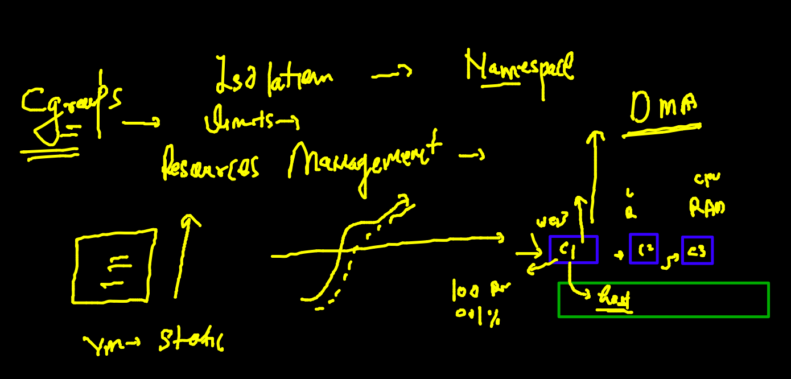

## training plan 


### DMA -- Dynamic memory allocation -- Cgroups 



### implementing cgroups in container 

```
22  docker run -d --name ashupyc2     --memory 200m      847b4522ef83
  123  docker run -d --name ashupyc3  --cpu-shares=20     --memory 200m      847b4522ef83
```

### restart policy in docker for auto starting container 


### list of restart policy 


### checking restart policy of your container 

```
docker  inspect  ashupyc3  --format='{{.HostConfig.RestartPolicy.Name}}'
```

### assign restart policy to container 

```
docker run -itd --name mec1  --restart always  alpine ping fb.com 
eabd96b9997cfc10811d768a64f0bccb9f860d5d66c7dba4a4d8e70d3ce5ee27
[ec2-user@ip-172-31-90-223 appimages]$ 
[ec2-user@ip-172-31-90-223 appimages]$ 
[ec2-user@ip-172-31-90-223 appimages]$ 
[ec2-user@ip-172-31-90-223 appimages]$ docker  inspect  mec1  --format='{{.HostConfig.RestartPolicy.Name}}'
always

```

### dockerfile for Java sample code 

### building image 
```
docker  build -t  ashujava:codev1 . 
Sending build context to Docker daemon  3.072kB
Step 1/7 : FROM openjdk
 ---> 1b3756d6df61
Step 2/7 : LABEL email=ashutoshh@linux.com
 ---> Running in 6167abc67ae1
Removing intermediate container 6167abc67ae1
 ---> 2dda1342f0f2
Step 3/7 : RUN mkdir /codedata
 ---> Running in fc6cd8ab4661
Removing intermediate container fc6cd8ab4661
 ---> cb6fac361ea8
Step 4/7 : ADD cisco.java /codedata/cisco.java
 ---> 7dfbf9c06019
Step 5/7 : WORKDIR  /codedata
 ---> Running in a15433e31606
Removing intermediate container a15433e31606
 ---> 5c6d33d5b9d1
Step 6/7 : RUN javac cisco.java
 ---> Running in 9a6a46f0eb81
Removing intermediate container 9a6a46f0eb81
 ---> 28b20ee1b86e
Step 7/7 : CMD ["java","myclass"]
 ---> Running in 7a7aa3763f5d
Removing intermediate container 7a7aa3763f5d
 ---> 157aa0aaa81c
Successfully built 157aa0aaa81c
Successfully tagged ashujava:codev1

```

### java container 
```
143  docker  run -itd --name ashuj1 ashujava:codev1
  144  docker logs -f  ashuj1
 
```

### checking internal details of container 

```
docker  exec -it  ashuj1  bash 
bash-4.4# 
bash-4.4# java -version 
openjdk version "17.0.1" 2021-10-19
OpenJDK Runtime Environment (build 17.0.1+12-39)
OpenJDK 64-Bit Server VM (build 17.0.1+12-39, mixed mode, sharing)
bash-4.4# uname -r
5.10.75-79.358.amzn2.x86_64
bash-4.4# cat  /etc/os-release 
NAME="Oracle Linux Server"
VERSION="8.5"
ID="ol"

```

### building image from custom dockerfile name 

```
 ls
cisco.java  customjdk.dockerfile  Dockerfile
[ec2-user@ip-172-31-90-223 javaapp]$ docker  build -t ashujava:codev2 -f customjdk.dockerfile .


```

### webapp containerization 


### frontend app with nginx web server 


### sample github html project containerization 

```
git clone  https://github.com/yenchiah/project-website-template
Cloning into 'project-website-template'...
remote: Enumerating objects: 937, done.
remote: Total 937 (delta 0), reused 0 (delta 0), pack-reused 937
Receiving objects: 100% (937/937), 1.07 MiB | 15.83 MiB/s, done.
Resolving deltas: 100% (585/585), done.


```

### building image 

```
 cd  project-website-template/
[ec2-user@ip-172-31-90-223 project-website-template]$ ls
css         embedding.html  img         js       menu.html  vid
Dockerfile  empty.html      index.html  LICENSE  README.md  widgets.html
[ec2-user@ip-172-31-90-223 project-website-template]$ docker  build -t  ciscowebapp:30novv1  . 
Sending build context to Docker daemon  1.004MB
Step 1/3 : FROM nginx
latest: Pulling from library/nginx
eff15d958d66: Pulling fs layer 
1e5351450a59: Pulling fs layer 
2df63e6ce2be: Pulling fs layer 

```

### creating container 

```
docker  run -d --name ashuc1  -p  5566:80  ciscowebapp:30novv1
6b48d849ad6d73f76991d40e3ebcac4490180985341704cb3bc71f84872216f6
[ec2-user@ip-172-31-90-223 project-website-template]$ docker  ps
CONTAINER ID   IMAGE                 COMMAND                  CREATED          STATUS          PORTS                                   NAMES
6b48d849ad6d   ciscowebapp:30novv1   "/docker-entrypoint.…"   17 seconds ago   Up 16 seconds   0.0.0.0:5566->80/tcp, :::5566->80/tcp   ashuc1

```

### Docker Networking 


### listing docker network bridges 

```
 docker  network  ls
NETWORK ID     NAME      DRIVER    SCOPE
399720931c33   bridge    bridge    local
6329283f7937   host      host      local
d0270484c551   none      null      local
[ec2-user@ip-172-31-90-223 appimages]$ docker  network  inspect  bridge
[
    {
        "Name": "bridge",
        "Id": "399720931c337b8ed3efac6f2efef2a3f810e80ff177908456ec87f7dd5805ad",
        "Created": "2021-11-29T04:01:04.977659177Z",
        "Scope": "local",
        "Driver": "bridge",
        "EnableIPv6": false,
        "IPAM": {
            "Driver": "default",
            "Options": null,
            "Config": [
                {
                    "Subnet": "172.17.0.0/16",
                    "Gateway": "172.17.0.1"
                }
                
 ```
 
### container check

```
 167  docker  run -itd --name ashuc1 alpine 
  168  docker  ps
  169  history 
[ec2-user@ip-172-31-90-223 appimages]$ docker  ps
CONTAINER ID   IMAGE     COMMAND     CREATED              STATUS          PORTS     NAMES
f6a210729aef   alpine    "/bin/sh"   10 seconds ago       Up 9 seconds              go_alpine
ce727e0c9ba0   alpine    "/bin/sh"   15 seconds ago       Up 13 seconds             praneethac1
835fd8fd72e1   alpine    "/bin/sh"   15 seconds ago       Up 14 seconds             mithun
9c2c64f81642   alpine    "/bin/sh"   About a minute ago   Up 59 seconds             ashuc1
[ec2-user@ip-172-31-90-223 appimages]$ 
[ec2-user@ip-172-31-90-223 appimages]$ 
[ec2-user@ip-172-31-90-223 appimages]$ docker  exec -it  ashuc1  sh 
/ # ifconfig 
eth0      Link encap:Ethernet  HWaddr 02:42:AC:11:00:02  
          inet addr:172.17.0.2  Bcast:172.17.255.255  Mask:255.255.0.0
          UP BROADCAST RUNNING MULTICAST  MTU:1500  Metric:1
          RX packets:11 errors:0 dropped:0 overruns:0 frame:0
          TX packets:0 errors:0 dropped:0 overruns:0 carrier:0
          collisions:0 txqueuelen:0 
          RX bytes:930 (930.0 B)  TX bytes:0 (0.0 B)

lo        Link encap:Local Loopback  
          inet addr:127.0.0.1  Mask:255.0.0.0
          UP LOOPBACK RUNNING  MTU:65536  Metric:1
          RX packets:0 errors:0 dropped:0 overruns:0 frame:0
          TX packets:0 errors:0 dropped:0 overruns:0 carrier:0
          collisions:0 txqueuelen:1000 
          RX bytes:0 (0.0 B)  TX bytes:0 (0.0 B)

/ # ping  172.17.0.3
PING 172.17.0.3 (172.17.0.3): 56 data bytes
64 bytes from 172.17.0.3: seq=0 ttl=64 time=0.156 ms
64 bytes from 172.17.0.3: seq=1 ttl=64 time=0.074 ms
64 bytes from 172.17.0.3: seq=2 ttl=64 time=0.089 ms
^C
--- 172.17.0.3 ping statistics ---
3 packets transmitted, 3 packets received, 0% packet loss
round-trip min/avg/max = 0.074/0.106/0.156 ms
/ # exit

```

### filtering ip address from inspect 

```
docker  inspect  ashuc1 --format='{{.NetworkSettings.IPAddress}}'
172.17.0.2

```

### Container can go outside host if host can -- using NAT 


### Docker networking 

```
appimages]$ docker  exec -it  ashuc1  sh 
/ # 
/ # ping  google.com 
PING google.com (142.250.188.206): 56 data bytes
64 bytes from 142.250.188.206: seq=0 ttl=50 time=0.903 ms
64 bytes from 142.250.188.206: seq=1 ttl=50 time=0.980 ms
64 bytes from 142.250.188.206: seq=2 ttl=50 time=0.955 ms
64 bytes from 142.250.188.206: seq=3 ttl=50 time=1.014 ms
64 bytes from 142.250.188.206: seq=4 ttl=50 time=0.975 ms
64 bytes from 142.250.188.206: seq=5 ttl=50 time=1.011 ms
^C
--- google.com ping statistics ---
6 packets transmitted, 6 packets received, 0% packet loss
round-trip min/avg/max = 0.903/0.973/1.014 ms
/ # exit

```


