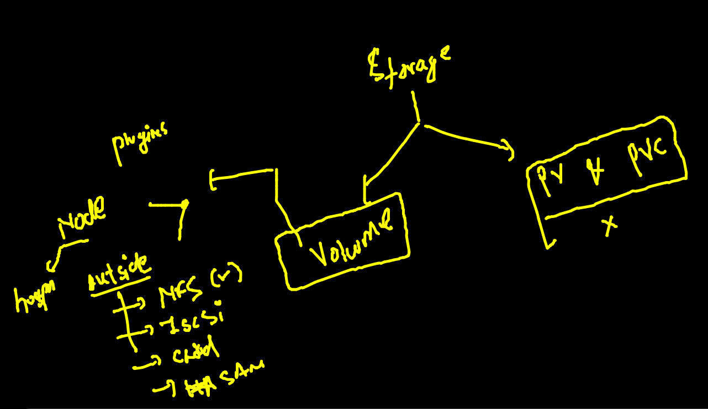

## training plan 


### checking namespace and delete all the data 

```
kubectl config get-contexts 
CURRENT   NAME                          CLUSTER      AUTHINFO           NAMESPACE
*         kubernetes-admin@kubernetes   kubernetes   kubernetes-admin   ashu-space
 fire@ashutoshhs-MacBook-Air  ~/Desktop/deployapps  
 fire@ashutoshhs-MacBook-Air  ~/Desktop/deployapps  
 fire@ashutoshhs-MacBook-Air  ~/Desktop/deployapps  kubectl  get  all 
NAME                           READY   STATUS    RESTARTS       AGE
pod/ashuapp-7847f955c9-dn59t   1/1     Running   0              108m
pod/ashuapp-7847f955c9-kb79l   1/1     Running   0              107m
pod/ashuapp-7847f955c9-zclqx   1/1     Running   1 (3h9m ago)   18h
pod/ashupod-2                  1/1     Running   4 (109m ago)   17h

NAME                TYPE       CLUSTER-IP       EXTERNAL-IP   PORT(S)          AGE
service/ashusvc2    NodePort   10.96.20.219     <none>        3000:30692/TCP   18h
service/yogeshvc1   NodePort   10.105.219.249   <none>        1234:31030/TCP   18h

NAME                      READY   UP-TO-DATE   AVAILABLE   AGE
deployment.apps/ashuapp   3/3     3            3           18h

NAME                                 DESIRED   CURRENT   READY   AGE
replicaset.apps/ashuapp-7847f955c9   3         3         3       18h

NAME                                          REFERENCE            TARGETS   MINPODS   MAXPODS   REPLICAS   AGE
horizontalpodautoscaler.autoscaling/ashuapp   Deployment/ashuapp   0%/80%    3         20        3          18h
 fire@ashutoshhs-MacBook-Air  ~/Desktop/deployapps  kubectl delete all --all
pod "ashuapp-7847f955c9-dn59t" deleted
pod "ashuapp-7847f955c9-kb79l" deleted
pod "ashuapp-7847f955c9-zclqx" deleted
pod "ashupod-2" deleted
service "ashusvc2" deleted
service "yogeshvc1" deleted
deployment.apps "ashuapp" deleted
horizontalpodautoscaler.autoscaling "ashuapp" deleted

```
### Deploy private registry image in k8s 

### creating deployment yaml 

```
kubectl create deployment privateweb --image=phx.ocir.io/axmbtg8judkl/webapp:v1  --dry-run=client -o yaml  >privateapp.yaml

```
### private docker image can't be deployed bcz it need to pass auth details 

### Intro to secret 


### creating secret in personal namespace 

```
kubectl create secret 
Create a secret using specified subcommand.

Available Commands:
  docker-registry Create a secret for use with a Docker registry
  generic         Create a secret from a local file, directory, or literal value
  tls             Create a TLS secret

===

kubectl create secret docker-registry ashusec1  --docker-server=phx.ocir.io  --docker-username="axmbtdkl/lear@gmail.com"    --docker-password=")#Bi4PKZcfc"

```

### calling secret in pod of template of deployment 


### deploy service from deployment using expose 

```
kubectl  get deploy
NAME         READY   UP-TO-DATE   AVAILABLE   AGE
privateweb   1/1     1            1           18m
 fire@ashutoshhs-MacBook-Air  ~/Desktop/deployapps  kubectl  expose deploy privateweb  --type LoadBalancer  --port 80 --name ashusvc1 
service/ashusvc1 exposed
 fire@ashutoshhs-MacBook-Air  ~/Desktop/deployapps  kubectl get  svc     
NAME       TYPE           CLUSTER-IP      EXTERNAL-IP   PORT(S)        AGE
ashusvc1   LoadBalancer   10.103.122.83   <pending>     80:31351/TCP   13s

```

### NodePort vs LoadBalancer 


## LimitRange in k8s 

### namespace security 


### Limit in Namespace 

```
apiVersion: v1 
kind: LimitRange
metadata:
 name: only-cpu-restrict
 namespace: ashu-space 
spec: 
 limits:
 - max:
    cpu: "700m" # 1 vcpu == 1000 milicore 
    memory: 800Mi
   min:
    cpu: "100m"
    memory: 200Mi 
   type: Container 

```

### deploy it 

```
kubectl apply -f limitforns.yaml 
limitrange/only-cpu-restrict created
 fire@ashutoshhs-MacBook-Air  ~/Desktop/deployapps  kubectl  get  limits 
NAME                CREATED AT
only-cpu-restrict   2021-12-03T05:31:53Z
 fire@ashutoshhs-MacBook-Air  ~/Desktop/deployapps  kubectl  describe limits only-cpu-restrict
Name:       only-cpu-restrict
Namespace:  ashu-space
Type        Resource  Min    Max    Default Request  Default Limit  Max Limit/Request Ratio
----        --------  ---    ---    ---------------  -------------  -----------------------
Container   cpu       100m   700m   700m             700m           -
Container   memory    200Mi  800Mi  800Mi            800Mi          -

```
### checking it 

```
kubectl apply -f ashu-pod1.yaml 
Error from server (Forbidden): error when creating "ashu-pod1.yaml": pods "ashupod-2" is forbidden: maximum cpu usage per Container is 700m, but limit is 900m

```
### Storage in k8s 


### Hostpath volume demo 

### creating pod 

```
kubectl  run  ashupod22  --image=alpine  --dry-run=client  -o yaml  >hostpath.yaml

===
apiVersion: v1
kind: Pod
metadata:
  creationTimestamp: null
  labels: # label of pod
    run: ashupod22
  name: ashupod22 # name of pod 
spec:
  volumes: # to create volume of diff type
  - name: ashuvol1 
    hostPath: # will take space from minion node 
     path: /ashudata1 # this location will be created in minion node
     type: DirectoryOrCreate # if above location not present then it will be created
  containers:
  - image: alpine
    name: ashupod22
    volumeMounts: # to attach volume in container 
    - name: ashuvol1 # name of volume 
      mountPath: /mnt/vol1 # location inside container 
    command: ["sh","-c","while true;do date >>/mnt/vol1/time.txt;sleep 10;done"]
    resources: {}
  dnsPolicy: ClusterFirst
  restartPolicy: Always
status: {}

```

### deploy pod 

```
kubectl apply -f hostpath.yaml 
pod/ashupod22 created
 fire@ashutoshhs-MacBook-Air  ~/Desktop/deployapps  kubectl  get  po 
NAME        READY   STATUS    RESTARTS   AGE
ashupod22   1/1     Running   0          8s
 fire@ashutoshhs-MacBook-Air  ~/Desktop/deployapps  kubectl exec -it ashupod22  -- sh 
/ # cd  /mnt/vol1/
/mnt/vol1 # ls
time.txt
/mnt/vol1 # cat  time.txt 
Fri Dec  3 06:19:02 UTC 2021
Fri Dec  3 06:19:12 UTC 2021
Fri Dec  3 06:19:22 UTC 2021
Fri Dec  3 06:19:32 UTC 2021
/mnt/vol1 # exit

```
### adding one more container in the same 

```
kubectl replace -f  hostpath.yaml --force
pod/ashupod23 replaced
 fire@ashutoshhs-MacBook-Air  ~/Desktop/deployapps  kubectl  get po
NAME        READY   STATUS    RESTARTS   AGE
ashupod22   1/1     Running   0          15m
ashupod23   2/2     Running   0          10s

```

### checking data 

```
kubectl exec -it ashupod23  -- bash
Defaulted container "ashuc4" out of: ashuc4, ashupod22
root@ashupod23:/# cd  /usr/share/nginx/html/
root@ashupod23:/usr/share/nginx/html# ls
time.txt
root@ashupod23:/usr/share/nginx/html# cat time.txt 
Fri Dec  3 06:34:19 UTC 2021
Fri Dec  3 06:34:29 UTC 2021
Fri Dec  3 06:34:39 UTC 2021

```
### DB single pod via deployment 

### yaml 

```
kubectl create deploy ashudb --image=mysql --dry-run=client -o yaml >db.yaml

```

### generating secret to store db root password 

```
kubectl create secret  generic  ashudbsec  --from-literal   mykey=CiscoDb0987 --dry-run=client -o yaml 
apiVersion: v1
data:
  mykey: Q2lzY29EYjA5ODc=
kind: Secret
metadata:
  creationTimestamp: null
  name: ashudbsec


```

### final YAML 

```
apiVersion: apps/v1
kind: Deployment
metadata:
  creationTimestamp: null
  labels:
    app: ashudb 
  name: ashudb # name of deployment 
spec:
  replicas: 1
  selector:
    matchLabels:
      app: ashudb
  strategy: {}
  template: # template to creation pod 
    metadata:
      creationTimestamp: null
      labels:
        app: ashudb
    spec:
      volumes: 
      - name: ashudbvol 
        hostPath:
         path: /ashudb
         type: DirectoryOrCreate 
      containers:
      - image: mysql # image from docker hub 
        name: mysql
        env: # to create or use env variable 
        - name: MYSQL_ROOT_PASSWORD # env var 
          valueFrom: # reading password from somewhere
           secretKeyRef:
            name: ashudbsec # name of secret 
            key: mykey # key name 
        volumeMount:
        - name: ashudbvol
          mountPath: /var/lib/mysql # this location is fixed for mysql db

        resources: {}
status: {}
# creating secret live 
---
apiVersion: v1
data:
  mykey: Q2lzY29EYjA5ODc= # password in encoded format 
kind: Secret
metadata:
  creationTimestamp: null
  name: ashudbsec # name of secret 


```

### deployed POD 

```
kubectl apply -f db.yaml 
deployment.apps/ashudb created
secret/ashudbsec created
 fire@ashutoshhs-MacBook-Air  ~/Desktop/deployapps  kubectl  get deploy 
NAME     READY   UP-TO-DATE   AVAILABLE   AGE
ashudb   0/1     1            0           14s
 fire@ashutoshhs-MacBook-Air  ~/Desktop/deployapps  kubectl  get  po    
NAME                      READY   STATUS    RESTARTS   AGE
ashudb-667c64c68f-2dr85   1/1     Running   0          19s

```

### checking status 

```
 kubectl  get deploy 
NAME     READY   UP-TO-DATE   AVAILABLE   AGE
ashudb   1/1     1            1           81m
 fire@ashutoshhs-MacBook-Air  ~/Desktop/deployapps  kubectl  get secret 
NAME                  TYPE                                  DATA   AGE
ashudbsec             Opaque                                1      81m
default-token-5bw9v   kubernetes.io/service-account-token   3      27h
 fire@ashutoshhs-MacBook-Air  ~/Desktop/deployapps  kubectl  get  svc  
No resources found in ashu-space namespace.
 fire@ashutoshhs-MacBook-Air  ~/Desktop/deployapps  kubectl  get  po 
NAME                      READY   STATUS    RESTARTS   AGE
ashudb-667c64c68f-2dr85   1/1     Running   0          81m
 fire@ashutoshhs-MacBook-Air  ~/Desktop/deployapps  kubectl  logs ashudb-667c64c68f-2dr85
2021-12-03 07:21:00+00:00 [Note] [Entrypoint]: Entrypoint script for MySQL Server 8.0.27-1debian10 started.
2021-12-03 07:21:00+00:00 [Note] [Entrypoint]: Switching to dedicated user 'mysql'

```
### two tier micro service app example 


### NFS storage configuration 


### creating service of cluster IP type 

```
kubectl expose deployment  ashudb  --type ClusterIP --port 3306 --dry-run=client -o yaml 

```

### deploy YAML 

```
 kubectl apply -f db.yaml 
deployment.apps/ashudb configured
secret/ashudbsec configured
service/ashudb created
 fire@ashutoshhs-MacBook-Air  ~/Desktop/deployapps  kubectl get  svc 
NAME     TYPE        CLUSTER-IP     EXTERNAL-IP   PORT(S)    AGE
ashudb   ClusterIP   10.102.47.64   <none>        3306/TCP   8s

```

### webapp for existing db 

```
kubectl  create deployment  ashuweb  --image=wordpress:4.8-apache --dry-run=client -o yaml 
===
 kubectl apply -f db.yaml 
deployment.apps/ashudb configured
secret/ashudbsec configured
service/ashudb configured
deployment.apps/ashuweb created
 fire@ashutoshhs-MacBook-Air  ~/Desktop/deployapps  kubectl get deploy
NAME      READY   UP-TO-DATE   AVAILABLE   AGE
ashudb    1/1     1            1           16m
ashuweb   1/1     1            1           8s
 fire@ashutoshhs-MacBook-Air  ~/Desktop/deployapps  kubectl get po  
NAME                       READY   STATUS    RESTARTS   AGE
ashudb-85c7c6c8f6-bmh4b    1/1     Running   0          16m
ashuweb-5cdc66f659-46ccn   1/1     Running   0          17s
 fire@ashutoshhs-MacBook-Air  ~/Desktop/deployapps  kubectl get svc
NAME     TYPE        CLUSTER-IP     EXTERNAL-IP   PORT(S)    AGE
ashudb   ClusterIP   10.102.47.64   <none>        3306/TCP   9m17s

```


