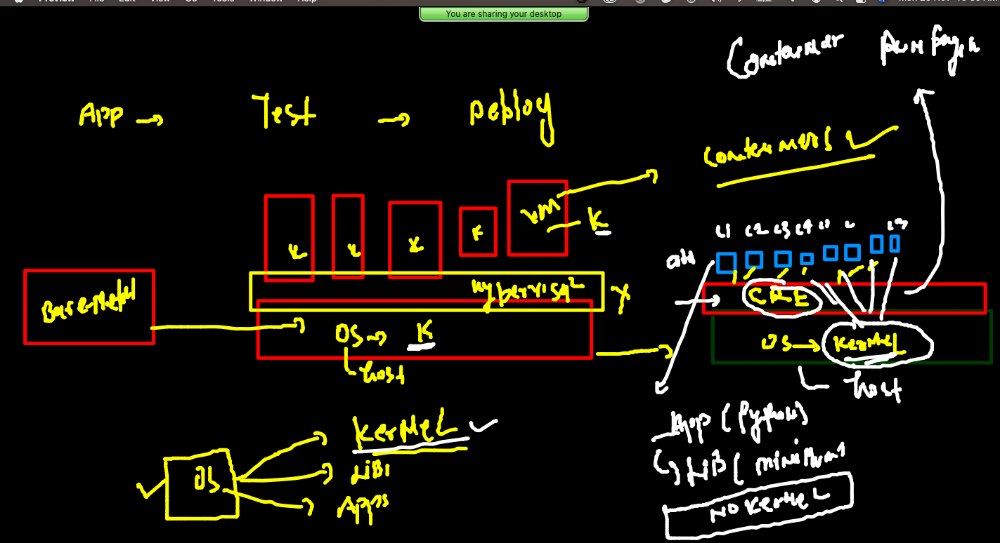

## training plan 


### problem in app deployment 


### intro to hypervisor -- Virtualization concept 


### problem with VM --due to entire guest OS 


## Default OS components 


## Containers are using host OS kernel 



### CRE 


## INtro about Docker 


### COntainers supported by Docker 


### Intro to docker Desktop 


### Docker Desktop download for MAC 

[Download](https://hub.docker.com/editions/community/docker-ce-desktop-mac)

### Docker Desktop download for Windows 10 / 11 

[Download](https://docs.docker.com/desktop/windows/install/)


### checking docker client side 

```
docker  -v
Docker version 20.10.8, build 3967b7d

```

### Docker engine from client side 

```
docker  version 
Client:
 Cloud integration: 1.0.17
 Version:           20.10.8
 API version:       1.41
 Go version:        go1.16.6
 Git commit:        3967b7d
 Built:             Fri Jul 30 19:55:20 2021
 OS/Arch:           darwin/amd64
 Context:           default
 Experimental:      true

Server: Docker Engine - Community
 Engine:
  Version:          20.10.8
  API version:      1.41 (minimum version 1.12)
  Go version:       go1.16.6
  Git commit:       75249d8
  Built:            Fri Jul 30 19:52:31 2021
  OS/Arch:          linux/amd64
  Experimental:     false
 containerd:
  Version:          1.4.9
  GitCommit:        e25210fe30a0a703442421b0f60afac609f950a3
 runc:
  Version:          1.0.1
  GitCommit:        v1.0.1-0-g4144b63
 docker-init:
  Version:          0.19.0
  GitCommit:        de40ad0


```

### Docker remote setup 


### Container images 


### Intro to image registry 


## Docker client operations 


### searching 

```
 docker  search   python
NAME                             DESCRIPTION                                     STARS     OFFICIAL   AUTOMATED
python                           Python is an interpreted, interactive, objec…   6769      [OK]       
pypy                             PyPy is a fast, compliant alternative implem…   297       [OK]       
nikolaik/python-nodejs           Python with Node.js                             86                   [OK]
joyzoursky/python-chromedriver   Python with Chromedriver, for running automa…   60                   [OK]
arm32v7/python                   Python is an interpreted, interactive, objec…   58                   
centos/python-35-centos7         Platform for building and running Python 3.5…   39                   
hylang                           Hy is a Lisp dialect that translates express…   39        [OK]       
centos/python-36-centos7         Platform for building and running Python 3.6…   33                   
arm64v8/python                   Python is an interpreted, interactive, objec…   25             

```

### checking docker images present on Docker host 

```
 docker  images
REPOSITORY   TAG       IMAGE ID   CREATED   SIZE
[Amith@ip-172-31-90-223 ~]$ 

```

### download image from docker hub

```
  docker pull  python 
Using default tag: latest
latest: Pulling from library/python
647acf3d48c2: Extracting [================================================>  ]  52.92MB/54.93MB
b02967ef0034: Download complete 
e1ad2231829e: Download complete 
5576ce26bf1d: Download complete 
a66b7f31b095: Download complete 
05189b5b2762: Download complete 
af08e8fda0d6: Download complete 

```

### 

```
 docker  images
REPOSITORY   TAG       IMAGE ID       CREATED       SIZE
openjdk      latest    1b3756d6df61   10 days ago   471MB
python       latest    f48ea80eae5a   11 days ago   917MB
java         latest    d23bdf5b1b1b   4 years ago   643MB

```

### Image to container 


### creating first container 

```
 docker  run  --name  ashuc1 -d   alpine:latest   ping  www.google.com 
627e400b8a237a188e6ea5ab3aa0c0503bbdf98148d237a2eb9614d3f357b454
[Amith@ip-172-31-90-223 ~]$ docker  ps
CONTAINER ID   IMAGE           COMMAND                 CREATED          STATUS          PORTS     NAMES
627e400b8a23   alpine:latest   "ping www.google.com"   47 seconds ago   Up 46 seconds             ashuc1
[Amith@ip-172-31-90-223 ~]$ 

```


### list of running containers 

```
 docker  ps
CONTAINER ID   IMAGE           COMMAND                 CREATED              STATUS              PORTS     NAMES
669d3c0b9325   alpine:latest   "ping www.google.com"   10 seconds ago       Up 9 seconds                  priyankatest1
627e400b8a23   alpine:latest   "ping www.google.com"   About a minute ago   Up About a minute             ashuc1

```

### checking output / logs

```
 docker  logs  ashuc1
PING www.google.com (142.251.111.104): 56 data bytes
64 bytes from 142.251.111.104: seq=0 ttl=51 time=1.479 ms
64 bytes from 142.251.111.104: seq=1 ttl=51 time=1.504 ms
64 bytes from 142.251.111.104: seq=2 ttl=51 time=1.544 ms
64 bytes from 142.251.111.104: seq=3 ttl=51 time=1.482 ms
64 bytes from 142.251.111.104: seq=4 ttl=51 time=1.479 ms
64 bytes from 142.251.111.104: seq=5 ttl=51 time=1.

```

### starting only stopped containers in one shot 

```
 docker  ps  -f  "status=exited"
CONTAINER ID   IMAGE           COMMAND                 CREATED          STATUS                       PORTS     NAMES
55ba3f564032   alpine:latest   "ping www.google.com"   9 minutes ago    Exited (137) 5 minutes ago             manuAlpineC2
e352cb2e04ca   alpine:latest   "ping www.google.com"   9 minutes ago    Exited (137) 4 minutes ago             goutham_c1
66c797e2687c   alpine:latest   "ping www.google.com"   9 minutes ago    Exited (137) 4 minutes ago             sathyag
78586d07bef0   alpine:latest   "ping www.google.com"   9 minutes ago    Exited (137) 5 minutes ago             yogesh
f047c12e0597   alpine:latest   "ping www.google.com"   9 minutes ago    Exited (137) 6 minutes ago             subhrajyoti
02dbdcea6dce   alpine:latest   "ping www.google.com"   10 minutes ago   Exited (0) 10 minutes ago              manuAlpineC1
669d3c0b9325   alpine:latest   "ping www.google.com"   10 minutes ago   Exited (137) 5 minutes ago             priyankatest1
7f907ab3d2ba   alpine:latest   "ping www.google.com"   11 minutes ago   Exited (0) 11 minutes ago              priyanka1
627e400b8a23   alpine:latest   "ping www.google.com"   11 minutes ago   Exited (137) 5 minutes ago             ashuc1
[Amith@ip-172-31-90-223 ~]$ 
[Amith@ip-172-31-90-223 ~]$ docker  ps  -f  "status=exited"  -q
55ba3f564032
e352cb2e04ca
66c797e2687c
78586d07bef0
f047c12e0597
02dbdcea6dce
669d3c0b9325
7f907ab3d2ba
627e400b8a23
[Amith@ip-172-31-90-223 ~]$ docker  start  $(docker  ps  -f  "status=exited"  -q)
55ba3f564032
e352cb2e04ca
66c797e2687c
78586d07bef0
f047c12e0597
02dbdcea6dce
669d3c0b9325
7f907ab3d2ba
627e400b8a23
[Amith@ip-172-31-90-223 ~]$ docker  ps
CONTAINER ID   IMAGE           COMMAND                 CREATED          STATUS         PORTS     NAMES
38fcba92ee76   alpine:latest   "ping www.google.com"   8 minutes ago    Up 4 minutes             sayed_docker_demo2
55ba3f564032   alpine:latest   "ping www.google.com"   9 minutes ago    Up 7 seconds             manuAlpineC2
e352cb2e04ca   alpine:latest   "ping www.google.com"   10 minutes ago   Up 6 seconds             goutham_c1
d855aaba3d97   alpine:latest   "ping www.google.com"   10 minutes ago   Up 2 minutes             amith-alp
9f9ecd430a98   alpine:latest   "ping www.google.com"   10 minutes ago   Up 5 minutes             chandra-alpine
66c797e2687c   alpine:latest   "ping www.google.com"   10 minutes ago   Up 6 seconds             sathyag
78586d07bef0   alpine:latest   "ping www.google.com"   10 minutes ago   Up 5 seconds             yogesh
f047c12e0597   alpine:latest   "ping www.google.com"   10 minutes ago   Up 5 seconds             subhrajyoti
7425e350cda1   alpine:latest   "ping www.google.com"   10 minutes ago   Up 5 minutes             praneetha
0ce31730b503   alpine:latest   "ping www.rediff.com"   11 minutes ago   Up 5 minutes             ashwathc1
02dbdcea6dce   alpine:latest   "ping www.google.com"   11 minutes ago   Up 4 seconds             manuAlpineC1
669d3c0b9325   alpine:latest   "ping www.google.com"   11 minutes ago   Up 4 seconds             priyankatest1
7f907ab3d2ba   alpine:latest   "ping www.google.com"   12 minutes ago   Up 3 seconds             priyanka1
627e400b8a23   alpine:latest   "ping www.google.com"   12 minutes ago   Up 3 seconds             ashuc1

```

### access any running container shell 

```

[Amith@ip-172-31-90-223 ~]$ 
[Amith@ip-172-31-90-223 ~]$ docker  exec  -it  ashuc1  sh 
/ # whoami
root
/ # uname  -r
5.10.75-79.358.amzn2.x86_64
/ # exit

```

### kill all running containds 

```
 docker  kill $(docker  ps -q)
38fcba92ee76
55ba3f564032
e352cb2e04ca
9f9ecd430a98
78586d07bef0
f047c12e0597
7425e350cda1
669d3c0b9325
7f907ab3d2ba
[Amith@ip-172-31-90-223 ~]$ docker  ps
CONTAINER ID   IMAGE     COMMAND   CREATED   STATUS    PORTS     NAMES

```


## removing all the dead containers 


```
docker  rm $(docker ps -aq)
38fcba92ee76
55ba3f564032
d855aaba3d97
9f9ecd430a98
78586d07bef0

```


